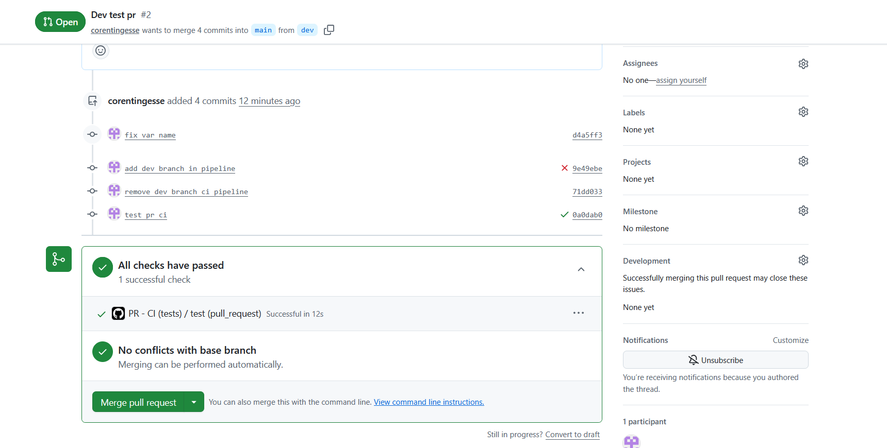
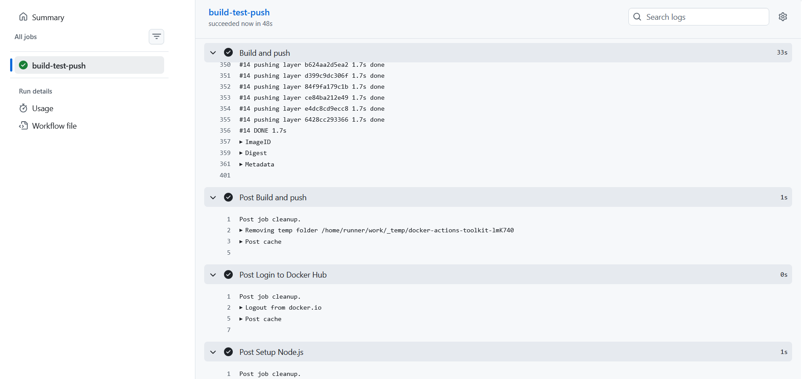
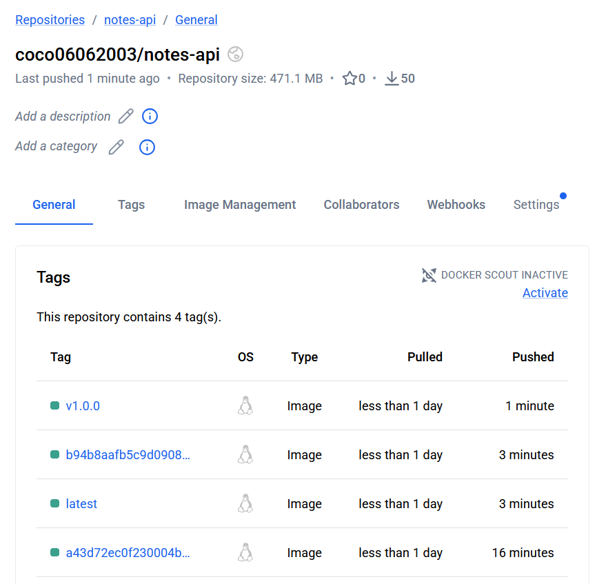

# CI Pipeline

## Auteurs

- Naël BENHIBA
- Corentin GESSE--ENTRESSANGLE

## Installation

### Prérequis

- Docker et Docker Compose
- Node.js 18
- npm

### Installation du projet

Depuis le dossier `TP-3`, installer les dépendances de l'API :

```bash
cd api
npm install
```

### Configuration

Le projet utilise un fichier `.env` à la racine de `TP-3` pour les variables de connexion à la base de données et la configuration de l'API.

Créer ce fichier à partir de l'exemple fourni :

```bash
cp .env.example .env
```

Puis adapter les valeurs si nécessaire.

### Lancement avec Docker Compose

Depuis le dossier `TP-3`, lancer les services :

```bash
docker compose up --build
```

L'API sera accessible sur `http://localhost:3000`.

### Lancement de l'API en local

Si la base de données est déjà disponible, l'API peut aussi être lancée manuellement :

```bash
cd api
npm start
```

### Lancement des tests

Depuis le dossier `TP-3/api` :

```bash
npm run test:run
```

## Preuves

### Pipeline CI sur pull request



### Push Docker après pipeline



### Nouvelles versions d'images Docker



## Release Process

Ce projet suit un workflow CI/CD simple afin de garantir la qualité, la traçabilité et la reproductibilité des releases.

### Intégration continue sur `main`

Lorsqu'un code est poussé sur `main`, le workflow `ci-main.yml` est déclenché.

Ce workflow :
- récupère le dépôt
- installe les dépendances de l'API
- exécute les tests automatisés avec Vitest
- se connecte à Docker Hub si les tests passent
- construit et pousse l'image Docker avec deux tags :
  - `latest`
  - le SHA complet du commit Git

Cela garantit que chaque image publiée depuis `main` est associée à un commit précis.

### Contrôle par pull request

Les nouvelles fonctionnalités doivent être développées sur une branche séparée, puis soumises via une pull request vers `main`.

Le workflow `pr-ci.yml` s'exécute automatiquement sur les pull requests vers `main` et :
- installe les dépendances
- exécute la suite de tests de l'API

Cela agit comme une quality gate avant le merge et aide à empêcher l'introduction de régressions dans `main`.

### Créer une release

Les releases produit sont gérées via un workflow dédié, déclenché par un tag Git tel que `v1.0.0`.

Déroulement type d'une release :
1. développer les changements sur une branche dédiée
2. ouvrir une pull request vers `main`
3. attendre que les vérifications de la PR passent
4. merger dans `main`
5. attendre la fin de la pipeline CI principale
6. créer et pousser un tag de version :

```bash
git tag v1.0.0
git push origin v1.0.0
```

Le workflow de release construit ensuite et pousse une image Docker versionnée correspondant à ce tag Git.

### Règles de versioning

- `latest` est uniquement un pointeur mobile vers l'image la plus récemment publiée depuis `main`
- le tag basé sur le SHA du commit identifie exactement quel commit a produit une image
- un tag de version comme `v1.0.0` représente une release produit
- une version publiée ne doit jamais être reconstruite avec un contenu différent

Ces règles améliorent la reproductibilité et rendent les déploiements plus sûrs.

### Traçabilité

La traçabilité est assurée par la combinaison de :
- l'historique Git pour les changements de code source
- les pull requests pour la revue et la validation
- les exécutions GitHub Actions pour l'historique des builds et des tests
- les tags Docker pour l'identification des artefacts

En particulier, le tag Docker basé sur le SHA permet de relier une image publiée au commit Git exact qui l'a produite.
