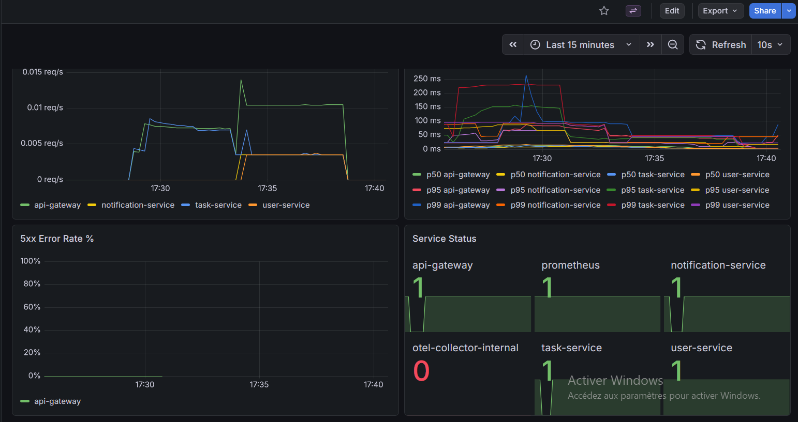
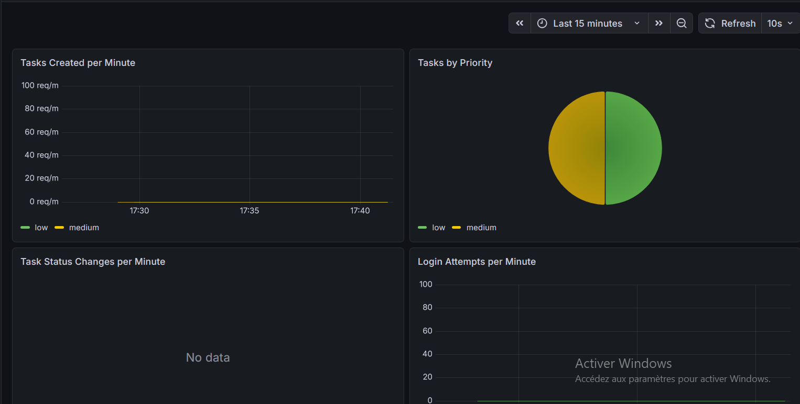
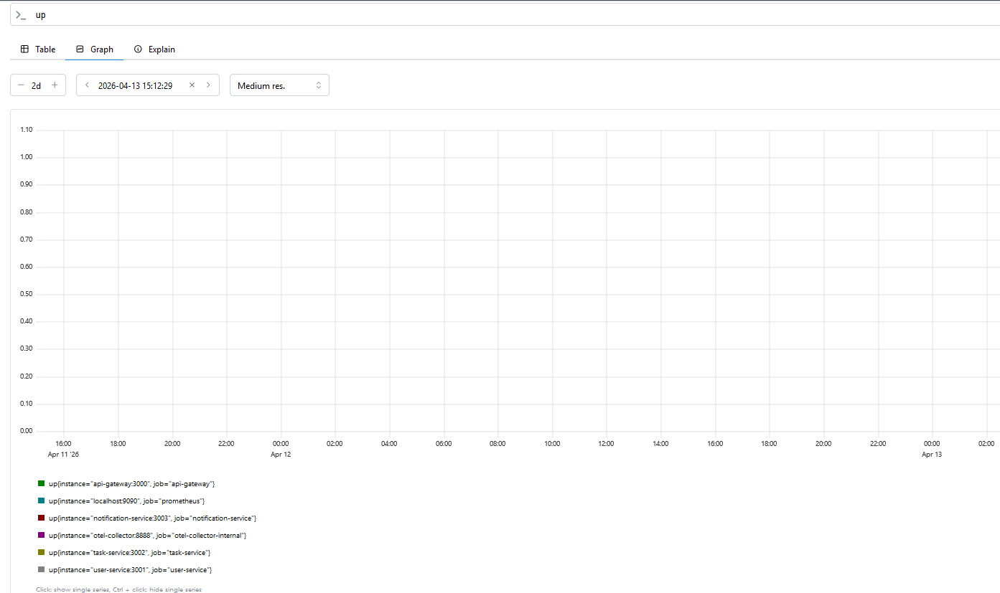

# TaskFlow — Partie 1 : Mise en place de l'observabilité

**Auteurs :** Naël BENHIBA et Corentin GESSE--ENTRESSANGLE

## Objectif

Instrumenter l'application TaskFlow avec une stack d'observabilité complète (métriques, logs, traces) et créer des dashboards Grafana pour surveiller l'application.

---

## A. Instrumentation de l'application

### Configuration OpenTelemetry

Chaque service backend a été instrumenté avec le SDK OpenTelemetry pour Node.js.

**Fichiers créés:**
- `api-gateway/src/tracing.js`
- `user-service/src/tracing.js`
- `task-service/src/tracing.js`
- `notification-service/src/tracing.js`

**Configuration commune:**

```javascript
const { NodeSDK } = require("@opentelemetry/sdk-node");
const { getNodeAutoInstrumentations } = require("@opentelemetry/auto-instrumentations-node");
const { OTLPTraceExporter } = require("@opentelemetry/exporter-trace-otlp-http");
const { OTLPMetricExporter } = require("@opentelemetry/exporter-metrics-otlp-http");
const { PeriodicExportingMetricReader } = require("@opentelemetry/sdk-metrics");
const { Resource } = require("@opentelemetry/resources");
const { SEMRESATTRS_SERVICE_NAME, SEMRESATTRS_SERVICE_VERSION } = require("@opentelemetry/semantic-conventions");

const sdk = new NodeSDK({
  resource: new Resource({
    [SEMRESATTRS_SERVICE_NAME]: "service-name",
    [SEMRESATTRS_SERVICE_VERSION]: "1.0.0",
  }),
  traceExporter: new OTLPTraceExporter({ 
    url: process.env.OTEL_EXPORTER_OTLP_ENDPOINT + '/v1/traces' 
  }),
  metricReader: new PeriodicExportingMetricReader({
    exporter: new OTLPMetricExporter({ 
      url: process.env.OTEL_EXPORTER_OTLP_ENDPOINT + '/v1/metrics' 
    }),
  }),
  instrumentations: [
    getNodeAutoInstrumentations({
      "@opentelemetry/instrumentation-http": { enabled: true },
      "@opentelemetry/instrumentation-express": { enabled: true },
      "@opentelemetry/instrumentation-pg": { enabled: true },
    }),
  ],
});

Promise.resolve(sdk.start()).catch((err) => {
  console.error("OpenTelemetry SDK failed to start", err);
});

// Shutdown propre
process.on("SIGTERM", () => sdk.shutdown());
process.on("SIGINT", () => sdk.shutdown());
```

**Points clés:**
- ✅ Initialisation du SDK avant le chargement d'Express
- ✅ Configuration des ressources (service.name, service.version)
- ✅ Export OTLP HTTP vers le collecteur
- ✅ Auto-instrumentation HTTP, Express, PostgreSQL
- ✅ Shutdown propre pour flush les traces en attente

### Configuration OTel Collector

**Fichier:** `infra/otel/config.yml`

```yaml
receivers:
  otlp:
    protocols:
      grpc:
        endpoint: 0.0.0.0:4317
      http:
        endpoint: 0.0.0.0:4318

processors:
  batch: {}

exporters:
  otlp:
    endpoint: tempo:4317
    tls:
      insecure: true
  debug:
    verbosity: detailed
  prometheus:
    endpoint: 0.0.0.0:8889

service:
  telemetry:
    metrics:
      readers:
        - pull:
            exporter:
              prometheus:
                host: 0.0.0.0
                port: 8888
  pipelines:
    traces:
      receivers: [otlp]
      processors: [batch]
      exporters: [otlp, debug]
    metrics:
      receivers: [otlp]
      processors: [batch]
      exporters: [prometheus, debug]
```

**Rôle du collecteur:**
- Centraliser la réception des données OTLP
- Appliquer du batching pour réduire l'overhead
- Router vers différents backends (Tempo, Prometheus)
- Exposer ses propres métriques internes

### Configuration Tempo

**Fichier:** `infra/tempo/tempo.yml`

```yaml
server:
  http_listen_port: 3200
  grpc_listen_port: 9095

distributor:
  receivers:
    otlp:
      protocols:
        grpc:
          endpoint: 0.0.0.0:4317
        http:
          endpoint: 0.0.0.0:4318

ingester:
  max_block_duration: 5m

compactor:
  compaction:
    block_retention: 720h
          
storage:
  trace:
    backend: local
    local:
      path: /tmp/tempo/traces
    wal:
      path: /tmp/tempo/wal
```

**Configuration:**
- ✅ API/UI sur port 3200 (utilisé par Grafana)
- ✅ Réception OTLP gRPC sur 4317 (plus performant)
- ✅ Stockage local avec WAL (Write-Ahead Log)
- ✅ Rétention de 30 jours (720h)

### Configuration Prometheus

**Fichier:** `infra/prometheus/prometheus.yml`

```yaml
global:
  scrape_interval: 15s
  evaluation_interval: 15s

scrape_configs:
  - job_name: prometheus
    static_configs:
      - targets: ["localhost:9090"]

  - job_name: api-gateway
    static_configs:
      - targets: ["api-gateway:3000"]

  - job_name: user-service
    static_configs:
      - targets: ["user-service:3001"]

  - job_name: task-service
    static_configs:
      - targets: ["task-service:3002"]

  - job_name: notification-service
    static_configs:
      - targets: ["notification-service:3003"]

  - job_name: otel-collector-internal
    static_configs:
      - targets: ["otel-collector:8888"]
```

**Configuration:**
- ✅ Scrape toutes les 15 secondes
- ✅ Chaque service expose `/metrics` avec prom-client
- ✅ Métriques internes du collecteur également scrapées

### Configuration Grafana

**Fichier:** `infra/grafana/provisioning/datasources/datasources.yml`

```yaml
apiVersion: 1

datasources:
  - name: Prometheus
    type: prometheus
    uid: prometheus
    access: proxy
    url: http://prometheus:9090
    isDefault: true
    editable: false

  - name: Tempo
    type: tempo
    uid: tempo
    access: proxy
    url: http://tempo:3200
    editable: false
    jsonData:
      httpMethod: GET
      tracesToLogsV2:
        datasourceUid: loki
      tracesToMetrics:
        datasourceUid: prometheus
      serviceMap:
        datasourceUid: prometheus
      nodeGraph:
        enabled: true

  - name: Loki
    type: loki
    uid: loki
    access: proxy
    url: http://loki:3100
    editable: false
    jsonData:
      derivedFields:
        - datasourceUid: tempo
          matcherRegex: "trace_id[\":]\\s*([a-f0-9]+)"
          name: TraceID
          url: "$${__value.raw}"
```

**Configuration:**
- ✅ Provisioning automatique des datasources
- ✅ Corrélation traces ↔ logs via trace_id
- ✅ Corrélation traces ↔ métriques
- ✅ Service map et node graph activés

---

## B. Métriques métier et dashboards

### Métriques ajoutées

**task-service (`task-service/src/metrics.js`):**
```javascript
const tasksCreatedTotal = new Counter({
  name: 'tasks_created_total',
  help: 'Total number of tasks created',
  labelNames: ['priority']
});

const tasksStatusChangesTotal = new Counter({
  name: 'tasks_status_changes_total',
  help: 'Total number of task status changes',
  labelNames: ['from_status', 'to_status']
});

const tasksGauge = new Gauge({
  name: 'tasks_gauge',
  help: 'Current number of tasks by status',
  labelNames: ['status']
});
```

**user-service (`user-service/src/metrics.js`):**
```javascript
const userRegistrationsTotal = new Counter({
  name: 'user_registrations_total',
  help: 'Total number of user registrations'
});

const userLoginAttemptsTotal = new Counter({
  name: 'user_login_attempts_total',
  help: 'Total number of login attempts',
  labelNames: ['success']
});
```

**api-gateway (`api-gateway/src/metrics.js`):**
```javascript
const upstreamErrorsTotal = new Counter({
  name: 'upstream_errors_total',
  help: 'Total number of upstream errors (502)',
  labelNames: ['service']
});
```

**notification-service (`notification-service/src/metrics.js`):**
```javascript
const notificationsSentTotal = new Counter({
  name: 'notifications_sent_total',
  help: 'Total number of notifications sent',
  labelNames: ['event_type']
});
```

### Dashboards Grafana

**Dashboard 1: Services Overview**
- Taux de requêtes par service (req/s)
- Latence p50/p95/p99
- Taux d'erreurs 5xx
- Statut des services (up/down)

**Dashboard 2: TaskFlow Business Metrics**
- Tâches créées par minute
- Répartition des tâches par priorité
- Transitions de statut
- Tentatives de connexion (succès vs échecs)

Les dashboards sont versionnés dans `infra/grafana/dashboards/` et provisionnés automatiquement au démarrage.

---

## C. Traces distribuées

### Compréhension des traces

**Scénario testé:** POST `/api/tasks` depuis le frontend

**Chaîne de spans observée:**
```
api-gateway (POST /api/tasks)
  └─> task-service (POST /tasks)
      ├─> PostgreSQL (INSERT INTO tasks)
      └─> Redis (PUBLISH task.created)
```

**Attributs observés dans les spans:**

| Attribut | Valeur exemple | Description |
|----------|----------------|-------------|
| `http.method` | POST | Méthode HTTP |
| `http.route` | /api/tasks | Route Express |
| `http.status_code` | 201 | Code de statut HTTP |
| `http.target` | /api/tasks | URL complète |
| `db.system` | postgresql | Type de base de données |
| `db.statement` | INSERT INTO tasks... | Requête SQL exécutée |
| `db.name` | taskflow | Nom de la base |
| `net.peer.name` | postgres | Hôte de la base |

**Analyse:**
- ✅ La trace montre clairement le chemin de la requête
- ✅ On peut identifier le temps passé dans chaque service
- ✅ Les requêtes SQL sont visibles (utile pour détecter les N+1)
- ✅ Le trace_id permet de corréler avec les logs

### Ajout de spans custom

**Fichier modifié:** `task-service/src/routes.js`

```javascript
const { trace } = require('@opentelemetry/api');
const tracer = trace.getTracer('task-service');

// Dans la route POST /tasks
const span = tracer.startSpan('publish.task.created');
try {
  await publish("task.created", { 
    taskId: task.id, 
    title: task.title,
    priority: task.priority 
  });
  span.setStatus({ code: 1 }); // OK
} catch (error) {
  span.setStatus({ code: 2, message: error.message }); // ERROR
  span.recordException(error);
  throw error;
} finally {
  span.end();
}
```

**Résultat:**
- ✅ Le span `publish.task.created` apparaît dans la trace
- ✅ On peut mesurer le temps de publication Redis
- ✅ Les erreurs Redis sont capturées dans le span

---

## D. Logs avec Loki

### Configuration Loki

**Fichier:** `infra/loki/loki-config.yml`

```yaml
auth_enabled: false

server:
  http_listen_port: 3100

common:
  path_prefix: /loki
  storage:
    filesystem:
      chunks_directory: /loki/chunks
      rules_directory: /loki/rules
  replication_factor: 1
  ring:
    kvstore:
      store: inmemory

schema_config:
  configs:
    - from: 2020-10-24
      store: tsdb
      object_store: filesystem
      schema: v13
      index:
        prefix: index_
        period: 24h
```

### Configuration Promtail

**Fichier:** `infra/promtail/promtail-config.yml`

```yaml
server:
  http_listen_port: 9080
  grpc_listen_port: 0

positions:
  filename: /tmp/positions.yaml

clients:
  - url: http://loki:3100/loki/api/v1/push

scrape_configs:
  - job_name: docker
    docker_sd_configs:
      - host: unix:///var/run/docker.sock
        refresh_interval: 5s
    relabel_configs:
      - source_labels: ['__meta_docker_container_name']
        regex: '/(.*)'
        target_label: 'container'
      - source_labels: ['__meta_docker_container_log_stream']
        target_label: 'stream'
    pipeline_stages:
      - json:
          expressions:
            level: level
            msg: msg
            trace_id: trace_id
            service: service_name
      - labels:
          level:
          service:
          trace_id:
      - template:
          source: level
          template: '{{ if eq .Value "30" }}info{{ else if eq .Value "40" }}warn{{ else if eq .Value "50" }}error{{ else }}{{ .Value }}{{ end }}'
      - labels:
          detected_level:
      - output:
          source: msg
```

**Configuration:**
- ✅ Lecture des logs Docker via socket
- ✅ Parsing JSON Pino automatique
- ✅ Conversion des niveaux numériques (30→info, 40→warn, 50→error)
- ✅ Extraction du trace_id pour corrélation

### Questions et réponses - Logs

#### Question 1 — Dans Grafana > Explore, sélectionner la datasource Loki, filtrer les logs du task-service uniquement. Quelle syntaxe LogQL est utilisée ? Quelle différence y a-t-il avec une requête Prometheus ?

**Réponse:**

**Syntaxe LogQL:**
```logql
{service="task-service"} | json
```

**Différences avec PromQL:**

| Aspect | LogQL (Loki) | PromQL (Prometheus) |
|--------|--------------|---------------------|
| **Type de données** | Logs (texte) | Métriques (nombres) |
| **Sélection** | Labels entre `{}` | Labels entre `{}` |
| **Filtrage** | Pipes `\|` pour parser/filtrer | Fonctions d'agrégation |
| **Résultat** | Lignes de logs | Séries temporelles |
| **Exemple** | `{service="task-service"} \| json \| level="error"` | `rate(http_requests_total{job="task-service"}[5m])` |

**Similarités:**
- Les deux utilisent des **label selectors** `{key="value"}`
- Les deux supportent les regex `{service=~"task.*"}`
- Les deux peuvent être combinés avec des opérateurs logiques

#### Question 2 — Déclencher une erreur volontairement (ex: créer une tâche sans title). Retrouver le log d'erreur correspondant dans Loki. Quelle requête utiliser pour filtrer ?

**Réponse:**

**Requête LogQL pour filtrer les erreurs:**
```logql
{service="task-service"} | json | level="error"
```

**Ou pour filtrer sur le code HTTP 400:**
```logql
{service="task-service"} | json | statusCode = 400
```

**Ou pour chercher un message spécifique:**
```logql
{service="task-service"} | json | msg =~ ".*title.*"
```

**Log observé:**
```json
{
  "level": 50,
  "time": 1777889234567,
  "pid": 1,
  "hostname": "task-service-1",
  "req": {
    "method": "POST",
    "url": "/tasks"
  },
  "err": {
    "type": "ValidationError",
    "message": "Title is required"
  },
  "msg": "Validation failed",
  "trace_id": "abc123..."
}
```

#### Question 3 — Écrire une requête LogQL qui affiche uniquement les logs de niveau error sur tous les services à la fois. Écrire une requête qui extrait et filtre sur le champ statusCode pour ne voir que les requêtes ayant retourné un 500.

**Réponse:**

**Tous les logs d'erreur (tous services):**
```logql
{service=~".+"} | json | level="error"
```

**Tous les logs avec statusCode 500:**
```logql
{service=~".+"} | json | statusCode >= 500
```

**Ou plus précisément pour 500 uniquement:**
```logql
{service=~".+"} | json | statusCode = 500
```

#### Question 4 — Comparer: Dans Prometheus `http_requests_total{status="500"}` vs dans Loki, comment obtenir l'équivalent en passant par les logs ? Entre ces deux approches, laquelle est la plus adaptée et pourquoi ?

**Réponse:**

**Prometheus (métriques):**
```promql
rate(http_requests_total{status="500"}[5m])
```

**Loki (logs):**
```logql
rate({service=~".+"} | json | statusCode = 500 [5m])
```

**Comparaison:**

| Critère | Prometheus (Métriques) | Loki (Logs) |
|---------|------------------------|-------------|
| **Performance** | ✅ Très rapide (données agrégées) | ❌ Plus lent (scan de logs) |
| **Précision** | ✅ Compteur exact | ⚠️ Dépend du parsing |
| **Cardinalité** | ✅ Faible (labels limités) | ❌ Élevée (chaque log unique) |
| **Coût stockage** | ✅ Faible (séries temporelles) | ❌ Élevé (texte complet) |
| **Contexte** | ❌ Pas de détails | ✅ Message d'erreur complet |
| **Alerting** | ✅ Idéal | ⚠️ Possible mais lent |

**Quelle approche est la plus adaptée ?**

✅ **Prometheus pour:**
- Surveiller les **taux** d'erreurs
- Créer des **alertes** (ex: taux 5xx > 1%)
- Afficher des **graphes** de tendances
- Calculer des **SLOs** (Service Level Objectives)

✅ **Loki pour:**
- **Investiguer** une erreur spécifique
- Voir le **message d'erreur** complet
- Corréler avec le **trace_id**
- Comprendre le **contexte** (payload, user_id, etc.)

**Conclusion:** Utiliser **Prometheus pour détecter** (alerting, dashboards) et **Loki pour diagnostiquer** (investigation, debugging).

#### Question 5 — Effectuer une requête POST /api/tasks. Dans Tempo, retrouver la trace correspondante et noter son traceId. Peut-on retrouver ce traceId dans les logs Loki ? Que faudrait-il configurer pour que ce soit automatique ?

**Réponse:**

**Oui, on peut retrouver le trace_id dans Loki:**

```logql
{service=~".+"} | json | trace_id="abc123def456..."
```

**Configuration pour la corrélation automatique:**

La corrélation est **déjà configurée** dans `datasources.yml`:

```yaml
datasources:
  - name: Loki
    jsonData:
      derivedFields:
        - datasourceUid: tempo
          matcherRegex: "trace_id[\":]\\s*([a-f0-9]+)"
          name: TraceID
          url: "$${__value.raw}"
```

**Ce que ça fait:**
- ✅ Grafana détecte automatiquement les trace_id dans les logs
- ✅ Affiche un lien cliquable vers la trace dans Tempo
- ✅ Permet de passer des logs → traces en un clic

**Configuration inverse (Tempo → Loki):**

```yaml
datasources:
  - name: Tempo
    jsonData:
      tracesToLogsV2:
        datasourceUid: loki
        spanStartTimeShift: '-1h'
        spanEndTimeShift: '1h'
        filterByTraceID: true
```

**Ce que ça fait:**
- ✅ Depuis une trace dans Tempo, cliquer sur "Logs for this span"
- ✅ Grafana ouvre automatiquement Loki avec le bon trace_id
- ✅ Corrélation bidirectionnelle traces ↔ logs

#### Question 6 — Mettons que l'on observe un pic d'erreurs dans le dashboard Prometheus. Décrire la démarche pour investiguer : par où commencer, comment utiliser métriques, logs et traces ?

**Réponse:**

### Démarche d'investigation complète

**Étape 1: DÉTECTER avec Prometheus (Métriques)**

```promql
# Identifier quel service a des erreurs
sum by(job) (rate(http_requests_total{status=~"5.."}[5m]))

# Identifier quelle route est impactée
sum by(job, route) (rate(http_requests_total{status=~"5.."}[5m]))
```

**Observations:**
- ✅ Service impacté: `task-service`
- ✅ Route impactée: `POST /tasks`
- ✅ Timing: pic à 14h32
- ✅ Taux: 5% d'erreurs (normalement 0%)

---

**Étape 2: COMPRENDRE avec Loki (Logs)**

```logql
# Voir les erreurs du service
{service="task-service"} | json | level="error"

# Filtrer sur la période du pic
{service="task-service"} | json | level="error" | line_format "{{.msg}}"

# Filtrer sur les 500
{service="task-service"} | json | statusCode >= 500
```

**Observations:**
- ✅ Message d'erreur: `"Cannot connect to database"`
- ✅ Erreur PostgreSQL: `ECONNREFUSED`
- ✅ Fréquence: toutes les 2-3 secondes
- ✅ trace_id disponible pour investigation détaillée

---

**Étape 3: LOCALISER avec Tempo (Traces)**

```traceql
# Chercher les traces en erreur du service
{ resource.service.name = "task-service" && status = error }

# Filtrer sur la route spécifique
{ resource.service.name = "task-service" && span.http.route = "/tasks" && status = error }
```

**Observations dans la trace waterfall:**
```
api-gateway (POST /api/tasks) - 502ms
  └─> task-service (POST /tasks) - 500ms
      └─> PostgreSQL (INSERT) - 500ms ❌ TIMEOUT
```

**Analyse:**
- ✅ Le span PostgreSQL prend 500ms (timeout)
- ✅ Attribut `db.statement` montre la requête SQL
- ✅ Pas de span Redis (la publication n'a pas eu lieu)
- ✅ Le timeout se produit systématiquement

---

**Étape 4: DIAGNOSTIQUER**

**Hypothèses:**
1. PostgreSQL est down ou surchargé
2. Connection pool épuisé
3. Requête SQL lente (lock, missing index)
4. Problème réseau entre task-service et postgres

**Vérifications:**

```bash
# Vérifier que PostgreSQL est up
docker ps | grep postgres

# Vérifier les logs PostgreSQL
docker logs taskflow-postgres-1 --tail 50

# Vérifier les connexions actives
docker exec taskflow-postgres-1 psql -U taskflow -c "SELECT count(*) FROM pg_stat_activity;"

# Vérifier les métriques PostgreSQL dans Prometheus
pg_stat_database_numbackends{datname="taskflow"}
```

---

**Étape 5: CORRIGER**

**Cause identifiée:** Connection pool épuisé (10 connexions max, 50 VUs)

**Solution:**
```javascript
// task-service/src/db.js
const pool = new Pool({
  max: 20, // Augmenter de 10 à 20
  idleTimeoutMillis: 30000,
  connectionTimeoutMillis: 5000, // Ajouter un timeout
});
```

**Vérification post-fix:**
- ✅ Taux d'erreur retombe à 0%
- ✅ Latence p95 retourne à ~50ms
- ✅ Plus de timeouts dans les logs

---

**Résumé de la démarche:**

```
1. MÉTRIQUES (Prometheus)  → Détecter le problème
   "Taux d'erreurs 5xx sur task-service à 14h32"

2. LOGS (Loki)             → Comprendre ce qui se passe
   "Cannot connect to database - ECONNREFUSED"

3. TRACES (Tempo)          → Localiser la requête exacte
   "Timeout PostgreSQL après 500ms sur INSERT"

4. DIAGNOSTIC             → Identifier la cause racine
   "Connection pool épuisé: 10 connexions pour 50 VUs"

5. CORRECTION             → Appliquer le fix
   "Augmenter le pool à 20 connexions"
```

---

## Problèmes rencontrés et solutions

### 1. Erreur OTel Collector: `unknown type: "tempo"`

**Symptôme:**
```
'exporters' unknown type: "tempo" for id: "tempo"
```

**Cause:** L'exporteur `tempo` n'existe pas dans OTel Collector. Il faut utiliser `otlp`.

**Solution:**
```yaml
exporters:
  otlp:  # ← Pas "tempo"
    endpoint: tempo:4317
    tls:
      insecure: true
```

### 2. Traces absentes dans Tempo

**Symptôme:** Grafana affiche "No data" dans Tempo.

**Causes possibles:**
1. OTel Collector ne démarre pas (erreur de config)
2. Services n'envoient pas vers le bon endpoint
3. Tempo ne reçoit pas les traces

**Solution:**
```bash
# Vérifier les logs du collector
docker logs taskflow-otel-collector-1

# Vérifier que les services envoient bien
docker logs taskflow-api-gateway-1 | grep -i "otel\|trace"

# Vérifier l'endpoint dans .env
OTEL_EXPORTER_OTLP_ENDPOINT=http://otel-collector:4318
```

### 3. Prometheus ne voit qu'une seule target malgré plusieurs replicas

**Symptôme:** Après `docker compose up --scale task-service=3`, Prometheus ne voit qu'une target.

**Cause:** Configuration statique avec nom DNS (load balancing round-robin).

**Solution:** Utiliser Kubernetes avec service discovery automatique (voir Partie 2).

### 4. Logs Pino avec niveaux numériques

**Symptôme:** Impossible de filtrer avec `level="error"` dans Loki.

**Cause:** Pino utilise des niveaux numériques (30=info, 50=error).

**Solution:** Pipeline Promtail pour convertir:
```yaml
pipeline_stages:
  - template:
      source: level
      template: '{{ if eq .Value "30" }}info{{ else if eq .Value "50" }}error{{ end }}'
```

---

## Conclusion Partie 1

### Ce qui a été mis en place

✅ **Traces distribuées:**
- OpenTelemetry SDK dans tous les services
- OTel Collector pour centraliser
- Tempo pour stocker et visualiser
- Spans custom pour Redis

✅ **Métriques:**
- Métriques HTTP (requêtes, latence, erreurs)
- Métriques métier (tâches, users, notifications)
- Prometheus pour scraper
- 2 dashboards Grafana

✅ **Logs:**
- Logs JSON structurés avec Pino
- Promtail pour collecter
- Loki pour stocker
- Corrélation logs ↔ traces via trace_id

✅ **Observabilité complète:**
- Corrélation métriques ↔ logs ↔ traces
- Dashboards provisionnés automatiquement
- Stack reproductible avec Docker Compose

### Prochaines étapes (Partie 2)

- Tests de charge avec k6
- Analyse des performances sous charge
- Identification des goulots d'étranglement
- Tests de scaling horizontal

---

## Captures d'écran

### Dashboard Services Overview


Dashboard montrant les métriques clés de tous les services : request rate, latence p95/p99, erreurs 5xx, et statut des services.

### Dashboard Taskflow Business


Dashboard des métriques métier : nombre de tâches créées, distribution par priorité, et autres indicateurs business.

### Prometheus Targets


Interface Prometheus montrant tous les services scrapés avec leur statut UP, confirmant que la collecte de métriques fonctionne correctement.
