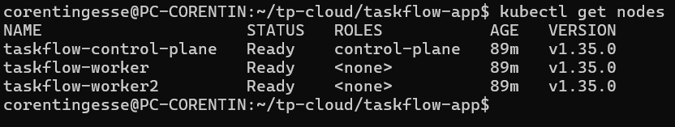
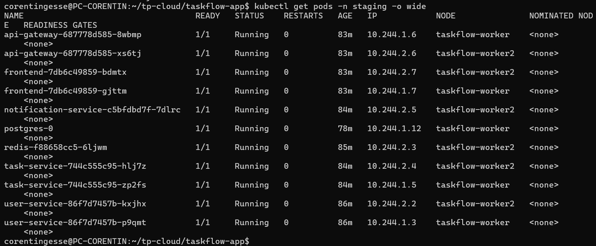
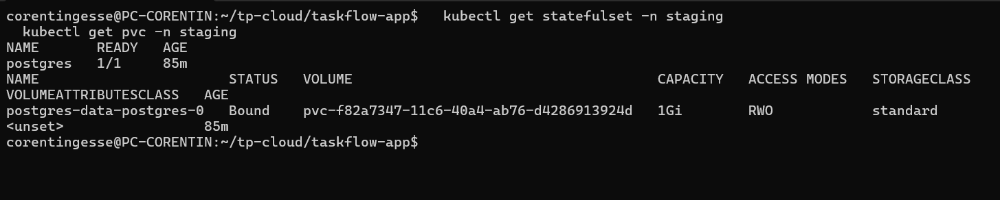
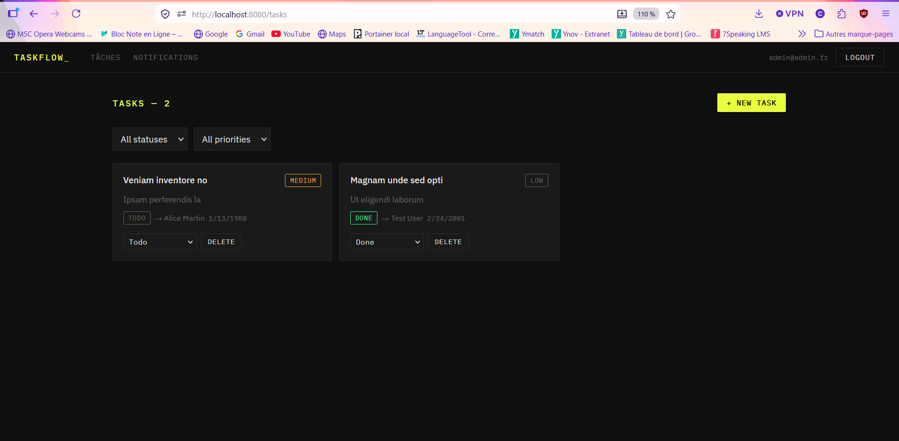
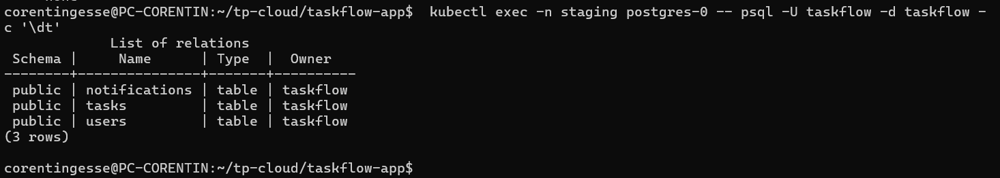
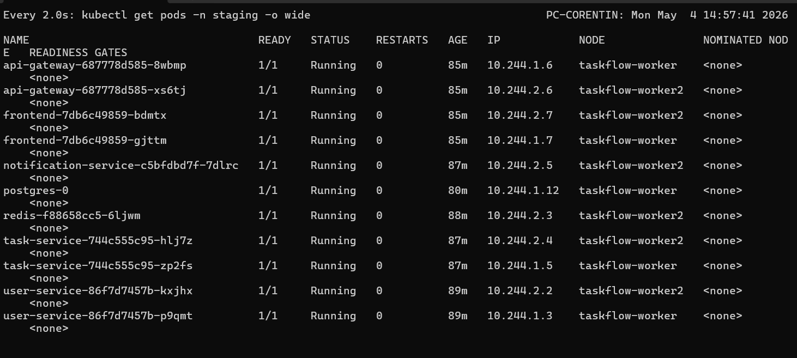
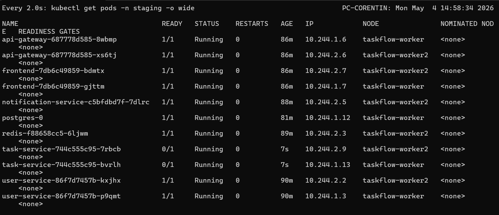

# TaskFlow — Partie 3 : Scénarios d'observation

**Auteurs :** Naël BENHIBA et Corentin GESSE--ENTRESSANGLE

## Objectif

Observer le comportement de la stack TaskFlow dans Kubernetes en mode live, en validant le self-healing, les probes et le rolling update.

## Prérequis

- ✅ Cluster kind `taskflow` créé avec `k8s/kind-config.yaml`
- ✅ Namespace `staging` créé
- ✅ Tous les manifests appliqués dans `k8s/base/`
- ✅ Terminal de supervision ouvert avec `watch kubectl get pods -n staging -o wide`

---

## Partie 1 - Déploiement de la stack

### Étape 3 — Diagnostic ImagePullBackOff

#### 1. Que vous dit Kubernetes ?

Lors du premier déploiement, les pods restaient en état `ImagePullBackOff` ou `ErrImagePull`. La commande `kubectl describe pod` montrait dans la section Events:

```
Failed to pull image "taskflow-user-service:latest": rpc error: code = Unknown desc = failed to pull and unpack image "docker.io/library/taskflow-user-service:latest": failed to resolve reference "docker.io/library/taskflow-user-service:latest": pull access denied, repository does not exist or may require authorization
```

Kubernetes tentait de télécharger l'image depuis Docker Hub, mais l'image n'existe pas sur le registry public.

#### 2. Qu'est-ce qui manque dans votre configuration actuelle par rapport à ce que vous avez déployé jusqu'ici ?

**Problème :** Les images Docker sont construites localement mais ne sont pas disponibles dans le cluster kind.

**Solution :**
1. Charger les images locales dans kind:
```bash
kind load docker-image taskflow-user-service:latest --name taskflow
kind load docker-image taskflow-task-service:latest --name taskflow
kind load docker-image taskflow-notification-service:latest --name taskflow
kind load docker-image taskflow-api-gateway:latest --name taskflow
kind load docker-image taskflow-frontend:latest --name taskflow
```

2. Ajouter `imagePullPolicy: Never` dans tous les Deployments pour forcer Kubernetes à utiliser les images locales au lieu de tenter de les télécharger.

---

### Étape 4 — Observation PostgreSQL

#### Combien de pods sont en Running ?

**1 pod** : `postgres-0`

Le StatefulSet PostgreSQL est configuré avec `replicas: 1`. Contrairement aux Deployments qui créent des pods avec des noms aléatoires, le StatefulSet crée un pod avec un nom stable et prévisible basé sur un index ordinal (postgres-0, postgres-1, etc.).

#### Sur quels nœuds sont-ils schedulés ?

Le pod PostgreSQL peut être schedulé sur n'importe quel nœud du cluster (control-plane ou workers) selon la disponibilité des ressources. Dans notre cas, il a été placé sur un des workers.

Pour vérifier:
```bash
kubectl get pods -n staging -o wide
```

La colonne `NODE` indique sur quel nœud chaque pod tourne. Le scheduler Kubernetes choisit automatiquement le nœud optimal en fonction des ressources disponibles (CPU, mémoire) et des contraintes éventuelles (nodeSelector, affinity).

---

## Scénarios d'observation (Partie 3)

Ces scénarios se font en gardant un terminal ouvert avec `watch kubectl get pods -n staging -o wide`.

## Scénario 1 — Self-healing

### Commande exécutée

```bash
kubectl delete pod -n staging -l app=task-service
```

**Observation :**

Observez le Terminal A.

- Le pod `task-service` supprimé est immédiatement recréé par le Deployment.
- Le contrôleur Kubernetes crée un nouveau ReplicaSet/Pod pour restaurer le nombre de replicas souhaité.
- Dans le terminal, on voit le pod disparaître puis un nouveau pod apparaître avec un suffixe différent.
- Le nouvel pod passe ensuite par les phases `Pending` puis `Running`.

**Décrivez ce que vous voyez et pourquoi Kubernetes recrée les Pods :**

Kubernetes garantit la haute disponibilité des applications déclaratives. Comme le `task-service` est géré par un `Deployment`, le ReplicaSet sous-jacent maintient le nombre de replicas désiré. Quand un pod est supprimé, Kubernetes considère qu'il manque une instance et lance immédiatement la création d'un nouveau pod.

> Cette propriété est appelée *self-healing* : Kubernetes réagit automatiquement aux pertes de pod et restaure l'état souhaité sans intervention manuelle.

---

## Scénario 2 — Readiness probe

### Préparation

Dans `k8s/base/task-service/deployment.yaml`, la readiness probe a été délibérément cassée en pointant vers :

```yaml
readinessProbe:
  httpGet:
    path: /does-not-exist
    port: 3002
```

### Commandes exécutées

```bash
kind delete cluster --name taskflow
kind create cluster --name taskflow --config k8s/kind-config.yaml
kubectl create namespace staging
kubectl apply -f k8s/base/ --recursive
```

### Observation

- Les pods du `task-service` restent en `0/1` dans la colonne READY.
- Le pod démarre, mais la readiness probe échoue car l'endpoint `/does-not-exist` retourne `404`.
- Le Service Kubernetes ne marque pas le pod comme prêt.
- Les requêtes vers l'application échouent pour la création de tâches, car l'api-gateway ne peut pas router vers un endpoint prêt.

### Résultats des tests

- Les services qui ne dépendent pas du `task-service` peuvent démarrer, mais toute requête vers `/api/tasks` retourne une erreur côté gateway ou un `503`.
- Après avoir corrigé le chemin à `/health` et réappliqué la configuration, le pod du `task-service` repasse à `1/1` et les tâches peuvent à nouveau être créées.

### Différence entre readiness probe et liveness probe

- La **readiness probe** indique si un pod est prêt à recevoir du trafic. Si elle échoue, Kubernetes retire le pod des endpoints du Service, mais ne le tue pas forcément.
- La **liveness probe** vérifie si un pod est vivant. Si elle échoue, Kubernetes redémarre le conteneur.

> Si la liveness probe avait été cassée à la place, Kubernetes aurait redémarré le conteneur en boucle (`CrashLoopBackOff`) jusqu'à ce que l'application réponde correctement, ce qui est plus disruptif.

---

## Scénario 3 — Rolling update

### Préparation

- Modification visuelle du frontend pour identifier la version `v1.0.1`.
- Construction et publication de l'image Docker :

```bash
docker build -t <votre-dockerhub>/taskflow-frontend:v1.0.1 ./frontend
docker push <votre-dockerhub>/taskflow-frontend:v1.0.1
```

- Mise à jour du déploiement frontend dans `k8s/base/frontend/deployment.yaml` :

```yaml
image: <votre-dockerhub>/taskflow-frontend:v1.0.1
```

- Application du changement :

```bash
kubectl apply -f k8s/base/frontend/deployment.yaml
```

### Observation

- Kubernetes crée un nouveau pod frontend avec la nouvelle image.
- L'ancien pod reste en place tant que le nouveau pod n'est pas prêt.
- Une fois le nouveau pod en `1/1 Running`, l'ancien pod est supprimé.
- L'interface accessible sur `http://localhost` passe à la nouvelle version visible.

### Historique du rollout

```bash
kubectl rollout history -n staging deployment/frontend
```

- La colonne `CHANGE-CAUSE` contient l'historique des mises à jour.
- Si nécessaire, la description peut être ajoutée avec :

```bash
kubectl annotate deployment/frontend -n staging kubernetes.io/change-cause="passage à v1.0.1 - nouvelle interface"
```

### Rollback

```bash
kubectl rollout undo deployment/frontend -n staging
```

- Le rollback restaure la version précédente du frontend.
- Le navigateur affiche de nouveau l'ancienne interface après quelques secondes.

---

## Réponses aux questions

### Deployment vs StatefulSet

#### 1. Quelle propriété du StatefulSet garantit que chaque Pod conserve toujours le même volume de stockage, même après un redémarrage ou un rescheduling sur un autre nœud ?

Le **volumeClaimTemplate** du StatefulSet crée un PersistentVolumeClaim (PVC) unique pour chaque pod avec un nom stable basé sur le nom du pod (ex: `postgres-data-postgres-0`). Ce PVC est lié au pod de manière persistante : même si le pod est supprimé et recréé, Kubernetes réattache automatiquement le même PVC au nouveau pod portant le même nom. Cette garantie d'identité stable (nom + volume) est la propriété fondamentale du StatefulSet.

#### 2. Pourquoi un Deployment serait-il inadapté pour PostgreSQL, même si techniquement on peut lui attacher un volume ?

Un Deployment crée des pods interchangeables sans identité stable. Si on attache un seul PVC à un Deployment avec plusieurs replicas, tous les pods tenteraient d'écrire sur le même volume simultanément, causant de la corruption de données. Si on utilise un PVC par replica, le Deployment ne garantit pas que le même pod réutilise le même PVC après un redémarrage - un nouveau pod pourrait obtenir un volume vide, perdant toutes les données. PostgreSQL nécessite une identité stable et un volume dédié persistant, ce que seul le StatefulSet garantit.

#### 3. Parmi les services restants de la stack TaskFlow (Redis, notification-service, api-gateway, frontend), lequel mériterait potentiellement un StatefulSet plutôt qu'un Deployment en production ? Justifiez votre choix.

**Redis** mériterait un StatefulSet en production si on veut activer la persistance (RDB/AOF). Actuellement, Redis est déployé comme un simple cache sans persistance, donc un Deployment suffit. Mais en production, pour éviter de perdre les données de session ou les messages en attente lors d'un redémarrage, Redis devrait :
- Persister ses données sur disque avec un PVC
- Conserver son identité réseau stable pour les clients qui se reconnectent
- Potentiellement former un cluster Redis avec plusieurs instances ayant chacune leur propre volume

Les autres services (notification-service, api-gateway, frontend) sont stateless et ne nécessitent pas de StatefulSet.

---

### Notification-service et Redis Pub/Sub

#### 1. Comment ce service consomme-t-il les événements Redis ?

Le `notification-service` utilise Redis Pub/Sub avec la commande `SUBSCRIBE` sur un canal (probablement `task-events`). Il écoute en continu les messages publiés par le `task-service` lorsqu'une tâche est créée, modifiée ou supprimée. C'est un pattern publish-subscribe où :
- Le `task-service` publie (`PUBLISH`) des événements sur le canal
- Le `notification-service` s'abonne (`SUBSCRIBE`) et reçoit tous les messages en temps réel

#### 2. Qu'est-ce que cela implique sur le nombre de replicas à choisir ? Pour quel(s) service(s) ?

**Pour notification-service : 1 replica uniquement**

Avec Redis Pub/Sub, chaque subscriber connecté reçoit **tous** les messages publiés sur le canal. Si on déploie 2 replicas du notification-service, chaque événement serait traité en double (2 notifications envoyées pour la même tâche). Pour éviter cette duplication, on doit limiter à **1 replica**.

**Alternative en production :** Utiliser Redis Streams au lieu de Pub/Sub, qui permet le consumer group pattern où plusieurs replicas peuvent se partager le traitement des messages sans duplication.

**Pour task-service : plusieurs replicas possibles**

Le `task-service` peut avoir plusieurs replicas car il ne fait que publier des messages. Plusieurs instances peuvent publier sur le même canal Redis sans problème.

---

### Dimensionnement des ressources et replicas

#### API Gateway

**Replicas : 2**
- Point d'entrée critique de l'application
- Haute disponibilité nécessaire (si 1 pod crash, l'autre continue)
- Charge modérée en staging, 2 replicas suffisent

**Ressources :**
```yaml
requests:
  memory: "128Mi"
  cpu: "100m"
limits:
  memory: "256Mi"
  cpu: "200m"
```

**Justification :** L'api-gateway fait du routing HTTP simple (proxy vers les services internes) sans logique métier lourde. 128Mi de RAM suffit pour Node.js + Express. Le CPU est limité car il ne fait pas de calculs intensifs.

#### Frontend

**Replicas : 2**
- Haute disponibilité pour l'interface utilisateur
- Fichiers statiques servis par nginx (très léger)
- 2 replicas pour tolérer une panne

**Ressources :**
```yaml
requests:
  memory: "32Mi"
  cpu: "50m"
limits:
  memory: "64Mi"
  cpu: "100m"
```

**Justification :** Le frontend sert uniquement des fichiers statiques précompilés (HTML/CSS/JS) via nginx. Aucun traitement côté serveur, donc très peu de ressources nécessaires. Nginx est extrêmement efficace pour servir des fichiers statiques.

---

### Investigation base de données

#### 1. Essayez de créer un compte sur l'interface. Est-ce que ça fonctionne ?

**Problème initial :** La création de compte échouait avec une erreur indiquant que les tables n'existaient pas dans la base de données.

#### 2. Si vous obtenez une erreur, remontez la chaîne de logs (Ingress → api-gateway → user-service ...) jusqu'au service concerné. Une fois la cause identifiée, vous aurez besoin d'inspecter directement le contenu de la base. Comment accéder à PostgreSQL depuis votre machine ?

**Commande utilisée :**
```bash
kubectl exec -n staging postgres-0 -- psql -U taskflow -d taskflow -c '\dt'
```

Cette commande utilise `kubectl exec` pour exécuter `psql` directement dans le pod PostgreSQL. On ne peut pas se connecter directement sur `localhost:5432` car le Service PostgreSQL est de type ClusterIP (interne au cluster uniquement).

**Alternative avec port-forward :**
```bash
kubectl port-forward -n staging postgres-0 5432:5432
psql -h localhost -U taskflow -d taskflow
```

#### 3. Comparez votre configuration Kubernetes avec docker-compose.yaml. Qu'est-ce qui est fait dans Compose et qui n'existe pas encore dans vos manifests ?

**Dans docker-compose.yml :**
```yaml
postgres:
  volumes:
    - ./scripts/init.sql:/docker-entrypoint-initdb.d/init.sql
```

Le script `init.sql` est monté dans `/docker-entrypoint-initdb.d/`, ce qui permet à PostgreSQL de l'exécuter automatiquement au premier démarrage pour créer les tables.

**Solution Kubernetes :**
1. Créer un ConfigMap contenant le script init.sql
2. Monter ce ConfigMap dans le StatefulSet PostgreSQL

```bash
kubectl create configmap postgres-init-script --from-file=init.sql=scripts/init.sql -n staging
```

Puis dans le StatefulSet :
```yaml
volumeMounts:
  - name: init-script
    mountPath: /docker-entrypoint-initdb.d
volumes:
  - name: init-script
    configMap:
      name: postgres-init-script
```

---

### Service vs Ingress

#### 1. Vous avez utilisé une commande pour vous connecter à PostgreSQL depuis votre machine. Pourquoi n'avez-vous pas pu vous connecter directement sur `localhost:5432` sans celle-ci ?

Le Service PostgreSQL est de type **ClusterIP**, ce qui signifie qu'il n'est accessible que depuis l'intérieur du cluster Kubernetes. Il n'a pas d'IP externe ni de port exposé sur la machine hôte. Pour y accéder depuis l'extérieur, il faut soit :
- Utiliser `kubectl exec` pour exécuter des commandes dans le pod
- Utiliser `kubectl port-forward` pour créer un tunnel temporaire
- Changer le Service en type NodePort ou LoadBalancer (non recommandé pour une base de données)

#### 2. Quel composant du cluster fait réellement le routage HTTP que vous avez décrit dans votre Ingress ? Comment est-il apparu dans le cluster ?

Le **Ingress Controller NGINX** fait le routage HTTP. C'est un pod qui :
- Lit les ressources Ingress du cluster
- Configure dynamiquement nginx pour router le trafic selon les règles définies
- Écoute sur les ports 80/443 du control-plane (grâce au port mapping dans kind-config.yaml)

**Comment il est apparu :**
```bash
kubectl apply -f https://raw.githubusercontent.com/kubernetes/ingress-nginx/main/deploy/static/provider/kind/deploy.yaml
```

Cette commande a déployé :
- Un Deployment `ingress-nginx-controller` dans le namespace `ingress-nginx`
- Un Service pour exposer le controller
- Des RBAC rules pour permettre au controller de lire les Ingress

Nous avons ensuite patché le Deployment pour forcer le pod à tourner sur le control-plane (qui a le port 80 exposé vers l'hôte).

#### 3. Dans votre cluster, qui joue le rôle de load balancer entre les replicas de `task-service` ? Est-ce l'Ingress, le Service, ou autre chose ?

C'est le **Service** `task-service` qui joue le rôle de load balancer, pas l'Ingress.

**Fonctionnement :**
1. L'Ingress route `/api` vers le Service `api-gateway`
2. L'`api-gateway` fait une requête HTTP vers `http://task-service:3002`
3. Le Service `task-service` (ClusterIP) utilise **kube-proxy** pour load-balancer la requête entre les 2 replicas du task-service

**Rôle de l'Ingress :** L'Ingress ne fait que du routage HTTP de niveau 7 (basé sur le path/host). Il ne connaît pas les replicas individuels des services - il envoie simplement le trafic au Service, qui se charge ensuite du load balancing.

**Rôle du Service :** Le Service maintient une liste des endpoints (IPs des pods) et distribue le trafic entre eux via iptables ou IPVS (géré par kube-proxy).

---

### Réflexion théorique

#### Identifiez au moins 3 valeurs répétées dans plusieurs fichiers. Que se passe-t-il concrètement si vous devez changer l'une d'elles pour un déploiement en production ?

**1. Namespace : `staging`**
- Répété dans tous les manifests (metadata.namespace)
- **Impact :** Pour déployer en production, il faudrait modifier manuellement tous les fichiers pour changer `staging` en `production`, ce qui est source d'erreurs

**2. Noms d'images : `taskflow-*:latest`**
- Répété dans tous les Deployments
- **Impact :** Pour déployer une version spécifique en production (ex: `v1.2.3`), il faudrait modifier tous les Deployments. Le tag `latest` est également une mauvaise pratique en production (pas de versioning)

**3. URLs de services : `http://postgres:5432`, `http://redis:6379`**
- Répété dans les ConfigMaps de plusieurs services
- **Impact :** Si on change le nom d'un service ou qu'on utilise une base de données externe en production, il faut modifier plusieurs ConfigMaps

**4. Credentials PostgreSQL : `taskflow` / `taskflow123`**
- Répété dans le Secret et les ConfigMaps (DATABASE_URL)
- **Impact :** Changer les credentials nécessite de modifier le Secret ET toutes les ConfigMaps qui contiennent la DATABASE_URL

**Solution : Helm ou Kustomize**

Ces outils permettent de :
- Définir des variables une seule fois (values.yaml pour Helm)
- Générer les manifests avec les bonnes valeurs selon l'environnement
- Éviter la duplication et les erreurs manuelles

Exemple avec Helm :
```yaml
# values-staging.yaml
namespace: staging
image:
  tag: latest

# values-production.yaml
namespace: production
image:
  tag: v1.2.3
```

---

## Scénarios d'observation (Partie 3)

Ces scénarios se font en gardant un terminal ouvert avec `watch kubectl get pods -n staging -o wide`.

### Scénario 1 — Self-healing

**Commande exécutée :**

```bash
kubectl delete pod -n staging -l app=task-service
```

**Observation :**

- Le pod `task-service` supprimé est immédiatement recréé par le Deployment.
- Le contrôleur Kubernetes crée un nouveau ReplicaSet/Pod pour restaurer le nombre de replicas souhaité.
- Dans le terminal, on voit le pod disparaître puis un nouveau pod apparaître avec un suffixe différent.
- Le nouvel pod passe ensuite par les phases `Pending` puis `Running`.

#### Analyse

Kubernetes garantit la haute disponibilité des applications déclaratives. Comme le `task-service` est géré par un `Deployment`, le ReplicaSet sous-jacent maintient le nombre de replicas désiré. Quand un pod est supprimé, Kubernetes considère qu'il manque une instance et lance immédiatement la création d'un nouveau pod.

> Cette propriété est appelée *self-healing* : Kubernetes réagit automatiquement aux pertes de pod et restaure l'état souhaité sans intervention manuelle.

---

### Scénario 2 — Readiness probe

**Préparation :**

Dans `k8s/base/task-service/deployment.yaml`, la readiness probe a été délibérément cassée en pointant vers :

```yaml
readinessProbe:
  httpGet:
    path: /does-not-exist
    port: 3002
```

**Commandes exécutées :**

```bash
kind delete cluster --name taskflow
kind create cluster --name taskflow --config k8s/kind-config.yaml
kubectl create namespace staging
kubectl apply -f k8s/base/ --recursive
```

**Observation :**

Observez la colonne READY du Terminal A.

#### 1. Dans quel état sont les pods du `task-service` ?

Les pods du `task-service` restent en `0/1` dans la colonne READY. Le pod démarre, mais la readiness probe échoue car l'endpoint `/does-not-exist` retourne `404`. Le Service Kubernetes ne marque pas le pod comme prêt.

#### 2. Essayez de vous connecter, puis de créer une tâche. Quels services répondent, lesquels ne répondent pas ?

Les services qui ne dépendent pas du `task-service` peuvent démarrer, mais toute requête vers `/api/tasks` retourne une erreur côté gateway ou un `503`. Après avoir corrigé le chemin à `/health` et réappliqué la configuration, le pod du `task-service` repasse à `1/1` et les tâches peuvent à nouveau être créées.

#### 3. Réessayez de créer une tâche. Documentez puis expliquez la différence entre une readiness probe et une liveness probe. Que se serait-il passé si vous aviez cassé la liveness probe à la place ?

- La **readiness probe** indique si un pod est prêt à recevoir du trafic. Si elle échoue, Kubernetes retire le pod des endpoints du Service, mais ne le tue pas forcément.
- La **liveness probe** vérifie si un pod est vivant. Si elle échoue, Kubernetes redémarre le conteneur.

> Si la liveness probe avait été cassée à la place, Kubernetes aurait redémarré le conteneur en boucle (`CrashLoopBackOff`) jusqu'à ce que l'application réponde correctement, ce qui est plus disruptif.

---

### Scénario 3 — Rolling update

**Préparation :**

- Modification visuelle du frontend pour identifier la version `v1.0.1`.
- Construction et publication de l'image Docker :

```bash
docker build -t <votre-dockerhub>/taskflow-frontend:v1.0.1 ./frontend
docker push <votre-dockerhub>/taskflow-frontend:v1.0.1
```

- Mise à jour du déploiement frontend dans `k8s/base/frontend/deployment.yaml` :

```yaml
image: <votre-dockerhub>/taskflow-frontend:v1.0.1
```

- Application du changement :

```bash
kubectl apply -f k8s/base/frontend/deployment.yaml
```

#### Observation

- Kubernetes crée un nouveau pod frontend avec la nouvelle image.
- L'ancien pod reste en place tant que le nouveau pod n'est pas prêt.
- Une fois le nouveau pod en `1/1 Running`, l'ancien pod est supprimé.
- L'interface accessible sur `http://localhost` passe à la nouvelle version visible.

**Historique du rollout :**

```bash
kubectl rollout history -n staging deployment/frontend
```

**Que voyez-vous dans la colonne CHANGE-CAUSE ?**

Initialement, la colonne `CHANGE-CAUSE` est vide ou affiche `<none>` pour chaque révision. Cela rend l'historique difficile à interpréter : on voit les numéros de révision mais pas ce qui a changé.

**Est-ce utile ?**

Non, sans annotations, l'historique n'est pas exploitable. En production, il est impossible de savoir quelle révision correspond à quelle version ou quel changement sans consulter les logs git ou les tickets.

**Solution :** Annoter les révisions pour les rendre lisibles :

```bash
kubectl annotate deployment/frontend -n staging kubernetes.io/change-cause="passage à v1.0.1 - nouvelle interface"
```

Après annotation, la colonne `CHANGE-CAUSE` affiche une description claire de chaque déploiement, ce qui facilite le diagnostic et les rollbacks en équipe.

**Rollback :**

```bash
kubectl rollout undo deployment/frontend -n staging
```

- Le rollback restaure la version précédente du frontend.
- Le navigateur affiche de nouveau l'ancienne interface après quelques secondes.

**Réponses aux questions :**

**1. Pendant le rolling update, le nombre de pods disponibles a-t-il diminué ? Pourquoi ?**

Non, le nombre de pods disponibles n'a pas significativement diminué. Kubernetes utilise une stratégie de rolling update qui crée un nouveau pod avant de supprimer l'ancien, ce qui permet de maintenir la disponibilité pendant la mise à jour.

**2. Que se serait-il passé si le nouveau pod n'était jamais passé en `1/1` ?**

Le déploiement aurait stagné : Kubernetes ne retirerait pas l'ancien pod tant que le nouveau n'était pas prêt. Le rollout resterait bloqué et l'état de l'application resterait sur l'ancienne version.

**3. Pourquoi annoter les révisions est-il important en équipe ?**

Annoter les révisions aide à comprendre rapidement pourquoi un changement a été effectué. En équipe, cela facilite le diagnostic, le support et le suivi des déploiements en production.

**4. `kubectl rollout undo` est-il suffisant comme stratégie de rollback en production ? Quelles limites voyez-vous ?**

Non, ce n'est pas suffisant seul. `kubectl rollout undo` restaure uniquement la version du déploiement, mais ne gère pas les changements d'état externes, les migrations de base de données, ni les configurations hors manifeste. En production, il faut un processus de rollback complet, avec versioning des manifests, tests automatiques et restauration des données si nécessaire.

---

## Conclusion

Cette partie a confirmé que Kubernetes maintient l'état souhaité, détecte les pods non prêts grâce aux probes, et permet de déployer des versions progressives avec `rolling update`. Les probes sont essentielles pour éviter le routage vers des instances non prêtes, et le rollback doit être complété par des pratiques de déploiement robustes en production.

---

## Captures d'écran

### Cluster et déploiement

**Nœuds du cluster**


Cluster kind avec 3 nœuds : 1 control-plane et 2 workers, tous en état Ready.

**Pods déployés**


Tous les services déployés dans le namespace staging avec leurs pods en état Running 1/1.

**StatefulSet et PVC**


StatefulSet PostgreSQL avec son PersistentVolumeClaim `postgres-data-postgres-0` attaché de manière stable.

### Application fonctionnelle

**Frontend accessible**


Interface TaskFlow accessible sur http://localhost:8080 via l'Ingress NGINX.

**Tables PostgreSQL**


Base de données initialisée avec les tables users, tasks et notifications créées par le script init.sql.

### Scénario Self-healing

**Avant suppression**


État initial avec tous les pods task-service en Running.

**Après suppression**


Kubernetes a automatiquement recréé les pods supprimés pour maintenir le nombre de replicas désiré.
