# TaskFlow — Partie 4B : Stack d'observabilité via Helm

**Auteurs :** Naël BENHIBA et Corentin GESSE--ENTRESSANGLE

## Objectif

Déployer la stack d'observabilité (Prometheus, Grafana, Alertmanager, kube-state-metrics) via le chart officiel `kube-prometheus-stack`, intégrer des dashboards custom, connecter TaskFlow à Prometheus via des `ServiceMonitor`, configurer des alertes et mettre en place l'auto-scaling.

---

## Étape 1 — Via chart officiel

### Comprendre les dépendances de chart

`kube-prometheus-stack` n'est pas un chart monolithique. L'inspection de son `Chart.yaml` via :

```bash
helm show chart prometheus-community/kube-prometheus-stack
```

**Problème rencontré :** lors de notre première tentative, cette commande a retourné une erreur indiquant que le dépôt `prometheus-community` était introuvable. Le dépôt Helm n'avait pas encore été ajouté sur nos machines. Nous avons dû l'ajouter et mettre à jour les dépôts avant de pouvoir continuer :

```bash
# Ajouter le dépôt prometheus-community
helm repo add prometheus-community https://prometheus-community.github.io/helm-charts

# Mettre à jour les dépôts locaux
helm repo update

# La commande fonctionne ensuite correctement
helm show chart prometheus-community/kube-prometheus-stack
```

Une fois le dépôt ajouté, la commande révèle une section `dependencies:` listant Prometheus, Alertmanager, Grafana et kube-state-metrics comme sous-charts. Helm les télécharge et les orchestre tous ensemble.

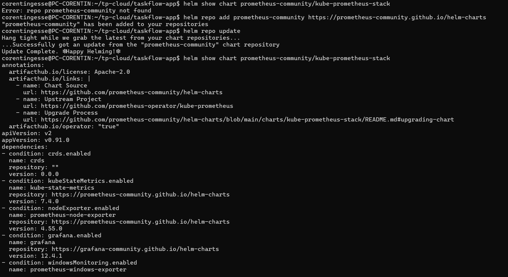

---

### Réflexion théorique — Dépendances et composition

#### Question 1 — Helm peut-il garantir que si l'installation de Grafana échoue, Prometheus est également annulé ?

**Réponse :**

**Non, Helm ne garantit pas ce comportement par défaut.**

Helm traite une release comme une unité atomique au niveau du chart, mais il n'offre **pas de rollback transactionnel automatique** entre sous-charts en cas d'échec partiel. Par défaut, si Grafana échoue à démarrer (pod en `CrashLoopBackOff`, timeout de readiness, etc.), Helm marque la release en état `failed` mais **ne supprime pas les ressources déjà créées** — Prometheus et Alertmanager restent déployés dans un état potentiellement incohérent.

D'après la [documentation officielle Helm](https://helm.sh/docs/helm/helm_upgrade/) et [helm install](https://helm.sh/docs/helm/helm_install/), ce comportement est contrôlé par le flag `--rollback-on-failure` (introduit dans Helm v4, remplaçant `--atomic` de Helm v3) :

- **`helm install`** : `--rollback-on-failure` — si l'installation échoue, Helm **désinstalle** automatiquement la release (équivalent d'un rollback vers l'état vide).
- **`helm upgrade`** : `--rollback-on-failure` — si l'upgrade échoue, Helm **revient automatiquement** à la révision précédente réussie.

Ces deux flags activent implicitement `--wait` (stratégie `watcher`), ce qui signifie que Helm attend que **tous les Pods soient en état `Ready`** avant de considérer l'opération comme réussie. Si un Pod (Grafana, Prometheus, ou autre) ne passe pas en `Ready` dans le délai `--timeout` (5 minutes par défaut), l'opération est considérée comme échouée et le rollback est déclenché.

**Nuance importante :** même avec `--rollback-on-failure`, Helm ne distingue pas quel sous-chart a échoué. Il rollback **l'ensemble de la release** — Prometheus sera donc bien annulé si Grafana échoue, mais uniquement parce que la release entière est rollbackée, pas parce que Helm comprend les dépendances inter-sous-charts.

---

#### Question 2 — Comment adapter les commandes `helm upgrade --install` et `helm install` pour garantir ce comportement ?

**Réponse :**

Il faut ajouter `--rollback-on-failure` (Helm v4) à toutes les commandes d'installation et de mise à jour. On peut également ajuster le timeout selon la complexité du chart :

**Pour `helm install` :**

```bash
helm install monitoring \
  prometheus-community/kube-prometheus-stack \
  --namespace monitoring \
  --create-namespace \
  --rollback-on-failure \
  --timeout 10m \
  -f helm/monitoring/values.monitoring.yaml \
  -f helm/monitoring/values.monitoring.secret.yaml
```

**Pour `helm upgrade --install` :**

```bash
helm upgrade --install monitoring \
  prometheus-community/kube-prometheus-stack \
  --namespace monitoring \
  --create-namespace \
  --rollback-on-failure \
  --timeout 10m \
  -f helm/monitoring/values.monitoring.yaml \
  -f helm/monitoring/values.monitoring.secret.yaml
```

**Pourquoi `--timeout 10m` ?**

`kube-prometheus-stack` déploie de nombreuses ressources (Deployments, StatefulSets, CRDs, DaemonSets). Le timeout par défaut de 5 minutes peut être insuffisant sur un cluster lent ou avec des images à télécharger. Augmenter à 10 minutes évite des rollbacks intempestifs dus à des délais réseau.

**Récapitulatif des flags :**

| Flag | Rôle | Applicable à |
|---|---|---|
| `--rollback-on-failure` | Rollback automatique si un Pod ne passe pas `Ready` | `install`, `upgrade` |
| `--wait` | Attend que toutes les ressources soient prêtes (activé implicitement par `--rollback-on-failure`) | `install`, `upgrade` |
| `--timeout 10m` | Délai maximum avant échec (défaut : 5m) | `install`, `upgrade` |
| `--cleanup-on-fail` | Supprime les **nouvelles** ressources créées lors d'un upgrade échoué (complément utile) | `upgrade` uniquement |

> **Note sur Helm v3 :** Si vous utilisez Helm v3, le flag équivalent est `--atomic` (qui combine `--wait` + rollback automatique). Helm v4 a renommé ce flag en `--rollback-on-failure` pour plus de clarté sémantique.


---

### Installer la stack

#### Commandes exécutées

```bash
# Ajouter le repo
helm repo add prometheus-community \
  https://prometheus-community.github.io/helm-charts
helm repo update

# Installer
helm upgrade --install monitoring \
  prometheus-community/kube-prometheus-stack \
  --namespace monitoring \
  --create-namespace \
  --set grafana.adminPassword=admin
```

#### Problèmes rencontrés

**Problème 1 — Cluster Kubernetes inaccessible**

Lors de notre première tentative d'installation, Helm a retourné l'erreur suivante :

```
Error: Kubernetes cluster unreachable: Get "https://127.0.0.1:36331/version":
dial tcp 127.0.0.1:36331: connect: connection refused
```

Le cluster kind `taskflow` existait bien (`kind get clusters` le confirmait) mais ses conteneurs Docker étaient arrêtés. Le réseau Docker interne avait été supprimé entre deux sessions, ce qui empêchait les conteneurs de redémarrer normalement avec `docker start`.

**Résolution :** nous avons régénéré le kubeconfig après redémarrage des conteneurs kind :

```bash
kind export kubeconfig --name taskflow
```

Puis vérifié que les nœuds étaient bien `Ready` :

```bash
kubectl get nodes
```

```
NAME                     STATUS   ROLES           AGE   VERSION
taskflow-control-plane   Ready    control-plane   23d   v1.35.0
taskflow-worker          Ready    <none>          23d   v1.35.0
taskflow-worker2         Ready    <none>          23d   v1.35.0
```

Une fois le contexte kubectl correctement pointé sur le cluster, la commande `helm upgrade --install` a pu s'exécuter :

```
Release "monitoring" does not exist. Installing it now.
```

#### Vérification des Pods

```bash
kubectl get pods -n monitoring -w
```

```
NAME                                                     READY   STATUS    RESTARTS   AGE
alertmanager-monitoring-kube-prometheus-alertmanager-0   2/2     Running   0          3m56s
monitoring-grafana-5958d97f97-mslfx                      3/3     Running   0          4m2s
monitoring-kube-prometheus-operator-65b7b55b54-wldp4     1/1     Running   0          4m2s
monitoring-kube-state-metrics-868694bc4b-k9mfl           1/1     Running   0          4m2s
monitoring-prometheus-node-exporter-8526w                1/1     Running   0          4m2s
monitoring-prometheus-node-exporter-r9mfn                1/1     Running   0          4m2s
monitoring-prometheus-node-exporter-sqpcx                1/1     Running   0          4m2s
prometheus-monitoring-kube-prometheus-prometheus-0       2/2     Running   0          3m56s
```

Tous les pods sont `Running` : Prometheus, Grafana (3/3 avec ses sidecars), Alertmanager (2/2), kube-state-metrics, et un node-exporter par nœud (3 nœuds = 3 pods).

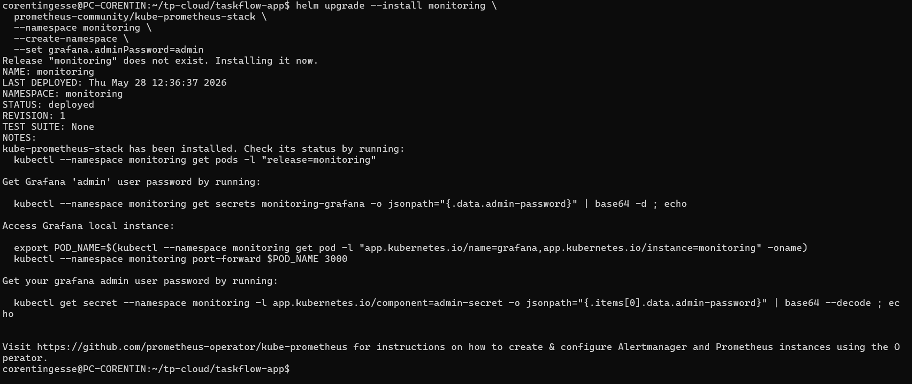

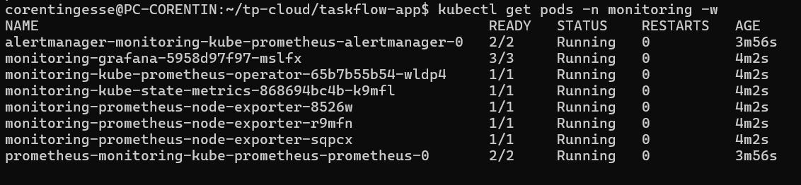

#### Accès à Grafana

**Problème 2 — Port-forward avec le mauvais port cible**

Notre première tentative utilisait `3100:80` mais le pod Grafana écoute en interne sur le port `3000`, pas `80`. La commande corrigée :

```bash
kubectl port-forward -n monitoring svc/monitoring-grafana 3100:3000
```

```
Forwarding from 127.0.0.1:3100 -> 3000
Forwarding from [::1]:3100 -> 3000
Handling connection for 3100
```

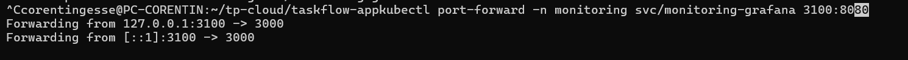

Grafana est accessible sur **http://localhost:3100** (admin / admin).

---

### Réflexion théorique — Pourquoi port-forward pour Grafana ?

#### Question 3 — Combien de fichiers avez-vous écrits pour installer cette stack complète ? Comparez avec ce que vous avez fait en partie 1.

**Réponse :**

**0 fichier écrit** pour installer la stack avec `kube-prometheus-stack`.

Une seule commande `helm upgrade --install` avec `--set grafana.adminPassword=admin` suffit à déployer Prometheus, Grafana, Alertmanager, kube-state-metrics et les node-exporters.

En **Partie 1** (docker-compose), nous avions dû écrire et maintenir :
- `docker-compose.infra.yml` — définition de tous les services (Prometheus, Grafana, Loki, Tempo, OTel Collector, Promtail)
- `infra/prometheus/prometheus.yml` — configuration du scraping
- `infra/grafana/provisioning/datasources/datasources.yml` — déclaration des datasources
- `infra/grafana/provisioning/dashboards/dashboards.yml` — configuration du chargement des dashboards
- `infra/grafana/dashboards/*.json` — les dashboards eux-mêmes

Soit **5+ fichiers de configuration** à écrire, maintenir et synchroniser manuellement.

Helm encapsule toute cette complexité dans un chart versionné et testé par la communauté. Le gain est considérable, surtout pour une stack aussi complète.

---

#### Question 4 — Quel mécanisme permet à TaskFlow d'être accessible sur le port 80 sans port-forward ?

**Réponse :**

Deux mécanismes combinés rendent TaskFlow accessible directement sur `http://localhost` :

**1. `extraPortMappings` dans `k8s/kind-config.yaml`**

```yaml
extraPortMappings:
  - containerPort: 80
    hostPort: 8080
    protocol: TCP
  - containerPort: 443
    hostPort: 8443
    protocol: TCP
```

Ce mapping crée un tunnel direct entre le port 80 du conteneur `control-plane` kind et le port 8080 de la machine hôte. Sans ça, aucune requête HTTP depuis `localhost` n'atteindrait le cluster.

**2. Ingress NGINX dans `k8s/base/ingress.yaml`**

```yaml
apiVersion: networking.k8s.io/v1
kind: Ingress
metadata:
  name: taskflow-ingress
  namespace: staging
spec:
  ingressClassName: nginx
  rules:
    - http:
        paths:
          - path: /api
            pathType: Prefix
            backend:
              service:
                name: api-gateway
                port:
                  number: 3000
          - path: /
            pathType: Prefix
            backend:
              service:
                name: frontend
                port:
                  number: 80
```

L'Ingress NGINX reçoit les requêtes entrantes sur le port 80 du nœud `control-plane` et les route vers les bons Services selon le chemin (`/api` → api-gateway, `/` → frontend). Le label `ingress-ready=true` sur le nœud control-plane garantit que le pod NGINX Ingress Controller est schedulé dessus, là où le port mapping est actif.

---

#### Question 5 — Pourquoi ce mécanisme ne fonctionne-t-il pas pour Grafana dans le namespace `monitoring` ?

**Réponse :**

Deux raisons :

1. **Pas de règle Ingress pour Grafana** : l'Ingress `taskflow-ingress` est dans le namespace `staging` et ne définit aucune route vers `monitoring-grafana`. Le contrôleur NGINX ne sait donc pas router les requêtes vers Grafana.

2. **Namespace différent** : même si on ajoutait une règle, un Ingress dans `staging` ne peut pas référencer directement un Service dans `monitoring` — les Ingress sont namespaced et les backends doivent être dans le même namespace que l'Ingress (sauf configuration spécifique avec des plugins cross-namespace).

Résultat : le seul moyen d'accéder à Grafana sans modifier l'Ingress existant est le `port-forward`, qui crée un tunnel direct depuis la machine locale vers le pod.

---

#### Question 6 — Quelle modification apporter pour rendre Grafana accessible via `http://localhost/grafana` ?

**Réponse :**

Sans toucher au code de `kube-prometheus-stack`, il faut créer un Ingress dédié dans le namespace `monitoring` qui route `/grafana` vers le Service `monitoring-grafana` :

```yaml
apiVersion: networking.k8s.io/v1
kind: Ingress
metadata:
  name: grafana-ingress
  namespace: monitoring
  annotations:
    nginx.ingress.kubernetes.io/rewrite-target: /$2
spec:
  ingressClassName: nginx
  rules:
    - http:
        paths:
          - path: /grafana(/|$)(.*)
            pathType: ImplementationSpecific
            backend:
              service:
                name: monitoring-grafana
                port:
                  number: 80
```

Il faut également configurer Grafana pour qu'il sache qu'il est servi depuis un sous-chemin, via les values Helm :

```yaml
# values.monitoring.yaml
kube-prometheus-stack:
  grafana:
    grafana.ini:
      server:
        root_url: "http://localhost/grafana"
        serve_from_sub_path: true
```

Sans `serve_from_sub_path: true`, Grafana génère des redirections vers `/` au lieu de `/grafana` et l'interface ne fonctionne pas correctement.

---

## Étape 2 — Intégrer ses dashboards customs

### Réflexion théorique — Surcharger les valeurs d'un chart tiers

`kube-prometheus-stack` expose des centaines de valeurs configurables. Notre `values.monitoring.yaml` surcharge certaines d'entre elles pour adapter la stack à notre contexte :

```yaml
# helm/monitoring/values.monitoring.yaml
grafana:
  sidecar:
    dashboards:
      enabled: true
      label: grafana_dashboard
  grafana.ini:
    server:
      root_url: "http://localhost:3100"
      serve_from_sub_path: true

prometheus:
  prometheusSpec:
    retention: 7d
    resources:
      requests:
        memory: "512Mi"
      limits:
        memory: "1Gi"
```

Les valeurs sensibles sont isolées dans `values.monitoring.secret.yaml` (basé sur `values.monitoring.secret.example.yaml`) :

```yaml
# values.monitoring.secret.example.yaml
grafana:
  adminPassword: ""
alertmanagerConfig:
  smtp:
    host: ""
    from: ""
    username: "<smtp-username-brevo>"
    password: "<smtp-password-brevo>"
    to: ""
```

---

#### Question 7 — Pourquoi séparer les valeurs sensibles dans un fichier à part ? Comment passer les deux fichiers à Helm en même temps ?

**Réponse :**

**Pourquoi séparer :**

Mettre les secrets (mot de passe Grafana, credentials SMTP) dans `values.monitoring.yaml` les exposerait dès que ce fichier est commité dans Git. N'importe qui ayant accès au dépôt pourrait lire les credentials en clair dans l'historique Git — même après suppression, ils restent dans les commits précédents.

En séparant dans `values.monitoring.secret.yaml` :
- Ce fichier est ajouté au `.gitignore` → jamais commité
- `values.monitoring.secret.example.yaml` sert de template documenté sans valeurs réelles → commité sans risque
- En CI/CD, le fichier secret est injecté depuis un vault (HashiCorp Vault, AWS Secrets Manager, etc.) au moment du déploiement

**Comment passer les deux fichiers à Helm :**

Le flag `-f` (ou `--values`) est cumulable. Helm fusionne les fichiers de gauche à droite, le dernier ayant la priorité en cas de clé dupliquée :

```bash
helm upgrade --install monitoring \
  prometheus-community/kube-prometheus-stack \
  --namespace monitoring \
  --create-namespace \
  -f helm/monitoring/values.monitoring.yaml \
  -f helm/monitoring/values.monitoring.secret.yaml
```

---

#### Question 8 — Quelle différence entre `--values mon-fichier.yaml` et `--set grafana.adminPassword=admin` ?

**Réponse :**

| | `--values fichier.yaml` | `--set clé=valeur` |
|---|---|---|
| **Format** | Fichier YAML structuré | Paramètre inline en ligne de commande |
| **Lisibilité** | ✅ Facile à lire et maintenir | ❌ Difficile pour des valeurs complexes |
| **Versioning** | ✅ Commitable dans Git (si pas de secrets) | ❌ Perdu si non documenté |
| **Secrets** | ✅ Fichier ignoré par Git | ❌ Visible dans l'historique shell (`~/.bash_history`) |
| **Valeurs complexes** | ✅ Supporte les listes, objets imbriqués | ⚠️ Syntaxe lourde pour les structures imbriquées |
| **CI/CD** | ✅ Fichier injecté depuis un vault | ⚠️ Variable d'environnement à gérer |

**Quand préférer l'un ou l'autre :**

- `--values` : pour toute configuration durable (paramètres de déploiement, ressources, configuration applicative). C'est la méthode standard en production.
- `--set` : pour des overrides ponctuels en développement ou des tests rapides. À éviter pour les secrets car la valeur apparaît dans l'historique du shell et dans les logs CI.

Dans notre cas, nous avons d'abord utilisé `--set grafana.adminPassword=admin` pour la première installation rapide, puis migré vers `-f values.monitoring.secret.yaml` pour avoir une configuration propre et reproductible.

---

### Réinstallation avec les fichiers de valeurs

```bash
helm upgrade --install monitoring \
  prometheus-community/kube-prometheus-stack \
  --namespace monitoring \
  --create-namespace \
  -f helm/monitoring/values.monitoring.yaml \
  -f helm/monitoring/values.monitoring.secret.yaml
```

**Problème rencontré :** la commande a d'abord retourné `Error: open helm/monitoring/values.monitoring.secret.yaml: no such file or directory`. Le fichier secret n'existait pas encore — seul le fichier exemple est commité dans le repo (c'est voulu, le vrai fichier est dans le `.gitignore`). Nous avons dû le créer à partir de l'exemple :

```bash
cp helm/monitoring/values.monitoring.secret.example.yaml helm/monitoring/values.monitoring.secret.yaml
```

Puis renseigner au minimum le mot de passe Grafana avant de relancer la commande.

Helm fusionne les deux fichiers et applique les surcharges sur le chart `kube-prometheus-stack` sans modifier son code source. La release est mise à jour en place (`upgrade`) sans recréer le namespace ni perdre les données existantes.

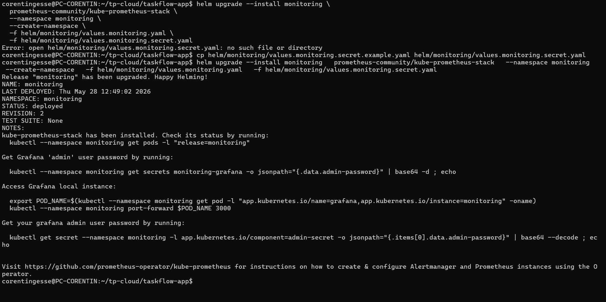

---

### Vérifier le mécanisme avec un ConfigMap inline

Le fichier `helm/monitoring/templates/dashboard-configmap.yaml` définit un ConfigMap labellisé `grafana_dashboard: "1"`. Grafana, configuré avec le sidecar `dashboards.enabled: true` dans `values.monitoring.yaml`, surveille automatiquement tous les ConfigMaps portant ce label dans le namespace `monitoring` et les charge comme dashboards.

#### Commande exécutée

```bash
kubectl apply -f helm/monitoring/templates/dashboard-configmap.yaml
```

```
configmap/taskflow-dashboard created
```

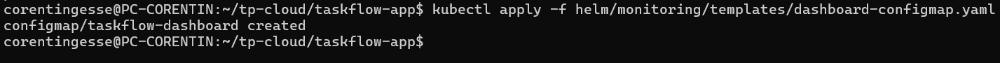

Cette commande crée le ConfigMap `taskflow-dashboard` dans le namespace `monitoring`. Le sidecar Grafana le détecte en quelques secondes et injecte le dashboard sans redémarrage de Grafana.

#### Réflexion théorique — Présence du dashboard dans Grafana

Le dashboard **"TaskFlow — Services"** apparaît automatiquement dans Grafana après rechargement de la page (Dashboards → Browse).

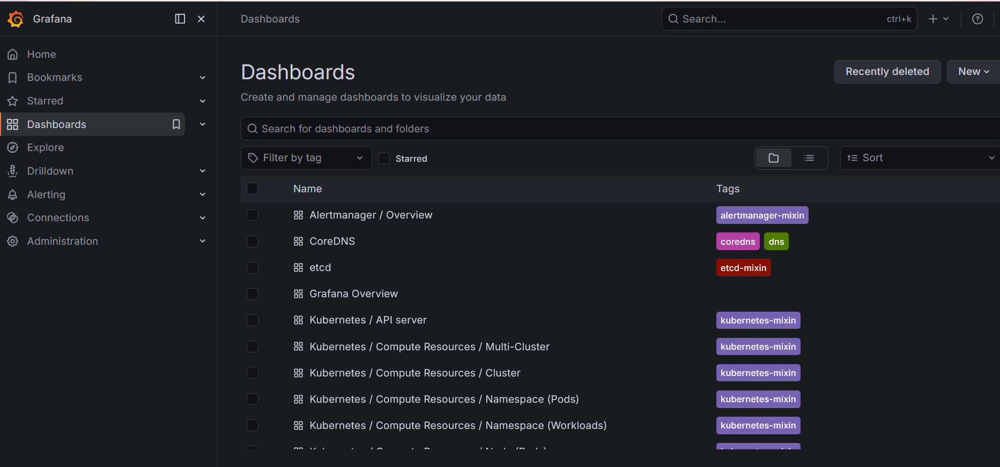

> ⚠️ **Limite de cette approche :** ce ConfigMap est créé **hors du contrôle de Helm** — il n'est pas tracé dans la release `monitoring`. Si on fait un `helm uninstall monitoring`, ce ConfigMap reste en place. C'est pourquoi l'étape suivante consiste à l'intégrer directement dans un chart Helm local.

---

### Créer un chart Helm local avec `kube-prometheus-stack` en dépendance

La méthode `kubectl apply` crée des ressources hors du contrôle de Helm — elles ne sont pas tracées dans la release et ne seront pas supprimées par `helm uninstall`. Pour gérer l'ensemble de la stack via Helm, nous avons créé un chart local `helm/monitoring/Chart.yaml` qui embarque `kube-prometheus-stack` comme dépendance.

#### Nettoyage de la release existante

```bash
helm uninstall monitoring -n monitoring
kubectl delete namespace monitoring
```

```
release "monitoring" uninstalled
namespace "monitoring" deleted
```

#### Création du `Chart.yaml`

```yaml
# helm/monitoring/Chart.yaml
apiVersion: v2
name: monitoring
description: Stack d'observabilité TaskFlow (Prometheus, Grafana, Alertmanager)
type: application
version: 0.1.0

dependencies:
  - name: kube-prometheus-stack
    version: ">=0.0.0-0"
    repository: https://prometheus-community.github.io/helm-charts
```

#### Téléchargement de la dépendance et installation

```bash
helm dependency update ./helm/monitoring
```

```
Saving 1 charts
Downloading kube-prometheus-stack from repo https://prometheus-community.github.io/helm-charts
Deleting outdated charts
```

```bash
helm upgrade --install monitoring ./helm/monitoring \
  --namespace monitoring \
  --create-namespace \
  -f helm/monitoring/values.monitoring.yaml \
  -f helm/monitoring/values.monitoring.secret.yaml
```

#### Problèmes rencontrés

**Problème 3 — `{{ job }}` interprété comme un template Helm**

La première tentative a échoué avec :

```
Error: parse error at (monitoring/templates/dashboard-configmap.yaml:19): function "job" not defined
```

Le fichier `dashboard-configmap.yaml` contient du JSON avec `{{ job }}` comme `legendFormat` Grafana. Helm interprète les doubles accolades comme des directives de template. La correction consiste à échapper les accolades :

```yaml
# Avant
"legendFormat": "{{ job }}"

# Après
"legendFormat": "{{ "{{" }} job {{ "}}" }}"
```

**Problème 4 — `PrometheusRule` avec `expr` vide**

Après correction du premier problème, une deuxième erreur est apparue :

```
Error: 1 error occurred:
* PrometheusRule.monitoring.coreos.com "taskflow-alerts" is invalid:
  spec.groups[0].rules[0].expr: Required value
```

Le fichier `alerts.yaml` contenait une règle `ServiceDown` incomplète (champ `expr` manquant avec un commentaire `# [...]`). Kubernetes rejette une `PrometheusRule` avec une expression vide. Nous avons complété les deux règles d'alerte (`ServiceDown` et `HighP95Latency`) avant de relancer l'installation.

**Problème 5 — `{{ $labels.job }}` interprété comme un template Helm**

Une troisième erreur est apparue :

```
Error: UPGRADE FAILED: parse error at (monitoring/templates/alerts.yaml:18): undefined variable "$labels"
```

Les annotations PromQL dans `alerts.yaml` utilisent `{{ $labels.job }}` — une syntaxe Prometheus valide mais que Helm interprète comme du templating Go. Même correction que pour le `dashboard-configmap.yaml` : échapper toutes les accolades doubles dans les chaînes YAML avec `{{ "{{" }}` et `{{ "}}" }}`.

#### Résultat final

```
Release "monitoring" has been upgraded. Happy Helming!
NAME: monitoring
LAST DEPLOYED: Thu May 28 14:11:57 2026
NAMESPACE: monitoring
STATUS: deployed
REVISION: 2
TEST SUITE: None
```

---

### Intégrer les dashboards via un dossier

#### Copie des dashboards JSON

```bash
mkdir helm/monitoring/dashboards
cp infra/grafana/dashboards/*.json helm/monitoring/dashboards/
```

Deux dashboards copiés :
- `services-overview.json`
- `taskflow-business.json`

#### Vérification de l'UID de la datasource

```bash
grep -r "uid" helm/monitoring/dashboards/
```

```
helm/monitoring/dashboards/taskflow-business.json:  "uid": "prometheus"
helm/monitoring/dashboards/services-overview.json:  "uid": "prometheus"
```

Les dashboards référencent l'UID `prometheus` — c'est exactement l'UID que `kube-prometheus-stack` utilise pour sa datasource Prometheus par défaut. Aucun remplacement nécessaire.

#### Mise à jour du `dashboard-configmap.yaml` avec `.Files.Glob`

Le template `dashboard-configmap.yaml` a été mis à jour pour charger automatiquement tous les fichiers `*.json` du dossier `dashboards/` via la fonction `.Files.Glob` de Helm :

```yaml
apiVersion: v1
kind: ConfigMap
metadata:
  name: taskflow-dashboards
  namespace: monitoring
  labels:
    grafana_dashboard: "1"
data:
{{- range $path, $bytes := .Files.Glob "dashboards/*.json" }}
  {{ base $path }}: |
{{ $.Files.Get $path | indent 4 }}
{{- end }}
```

#### Réflexion théorique — Limites du ConfigMap inline

**Question 9 — Pourquoi serait-il problématique de coller le JSON directement dans le ConfigMap avec `|` ?**

Coller les JSON directement dans le champ `data` du ConfigMap pose plusieurs problèmes :

1. **Maintenabilité** : les fichiers JSON de dashboards Grafana font souvent plusieurs centaines de lignes. Les intégrer inline dans un YAML rend le fichier illisible et très difficile à modifier.
2. **Lisibilité** : l'indentation YAML doit être respectée pour tout le JSON — la moindre erreur d'indentation casse le ConfigMap.
3. **Scalabilité** : avec plusieurs dashboards (`services-overview.json`, `taskflow-business.json`...), il faudrait un ConfigMap par dashboard ou un seul fichier template gigantesque à modifier manuellement à chaque ajout.

**Question 10 — Quelle fonction Helm charge automatiquement tous les `*.json` d'un dossier ?**

La fonction `.Files.Glob` combinée à `range` permet de charger tous les fichiers d'un dossier en une seule déclaration :

```yaml
{{- range $path, $bytes := .Files.Glob "dashboards/*.json" }}
  {{ base $path }}: |
{{ $.Files.Get $path | indent 4 }}
{{- end }}
```

- `.Files.Glob "dashboards/*.json"` retourne tous les fichiers JSON du dossier
- `range` itère sur chaque fichier
- `base $path` extrait le nom du fichier (ex: `services-overview.json`)
- `.Files.Get $path | indent 4` charge le contenu et l'indente correctement pour le YAML

Ajouter un nouveau dashboard ne nécessite plus de modifier le template — il suffit de déposer un fichier JSON dans `helm/monitoring/dashboards/`.

#### Réinstallation

```bash
helm upgrade --install monitoring ./helm/monitoring \
  --namespace monitoring \
  -f helm/monitoring/values.monitoring.yaml \
  -f helm/monitoring/values.monitoring.secret.yaml
```

```
Release "monitoring" has been upgraded. Happy Helming!
NAME: monitoring
LAST DEPLOYED: Thu May 28 14:16:40 2026
NAMESPACE: monitoring
STATUS: deployed
REVISION: 3
TEST SUITE: None
```

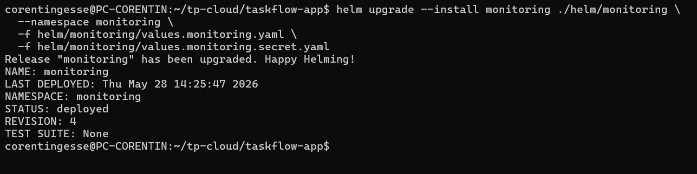

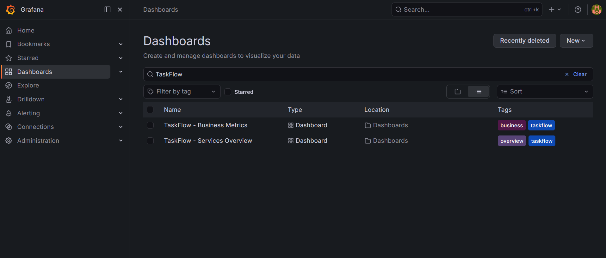


---

## Étape 3 — Connecter TaskFlow à Prometheus

### Prérequis : préparer les Services TaskFlow

Pour qu'un `ServiceMonitor` puisse cibler un Service, deux conditions sont nécessaires :
- Le Service doit avoir un **label** dans ses `metadata` (pour que le selector du ServiceMonitor le trouve)
- Le port doit avoir un **nom** (pour que le ServiceMonitor puisse le référencer par nom plutôt que par numéro)

Nous avons mis à jour tous les Services backend dans `helm/taskflow/templates/` en ajoutant `labels: app: <nom-service>` et `name: http` sur le port. Exemple pour `user-service` :

```yaml
apiVersion: v1
kind: Service
metadata:
  name: user-service
  namespace: {{ .Release.Namespace }}
  labels:
    app: user-service   # ← label ajouté
spec:
  selector:
    app: user-service
  ports:
    - name: http        # ← nom de port ajouté
      port: 3001
      targetPort: 3001
```

#### Déploiement taskflow mis à jour

```bash
helm upgrade --install taskflow ./helm/taskflow \
  --namespace staging \
  --create-namespace \
  --reset-values
```

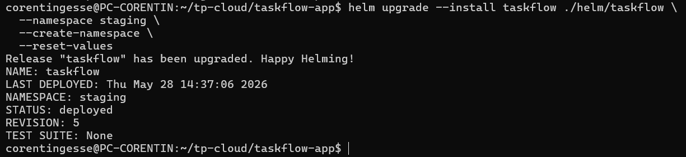

---

### Créer les ServiceMonitors avec `range`

Au lieu de créer 4 fichiers quasi-identiques, nous avons utilisé l'action `range` de Helm pour générer les 4 `ServiceMonitor` en un seul fichier `helm/monitoring/templates/service-monitors.yaml` :

```yaml
{{- range list "api-gateway" "task-service" "user-service" "notification-service" }}
---
apiVersion: monitoring.coreos.com/v1
kind: ServiceMonitor
metadata:
  name: {{ . }}
  namespace: monitoring
  labels:
    release: monitoring
spec:
  namespaceSelector:
    matchNames:
      - staging
  selector:
    matchLabels:
      app: {{ . }}
  endpoints:
    - port: http
      path: /metrics
{{- end }}
```

`range` itère sur la liste des 4 services et génère un `ServiceMonitor` identique pour chacun, en substituant le nom à chaque itération. Sans `range`, il aurait fallu 4 fichiers séparés avec 95% de contenu dupliqué.

---

### Autoriser Prometheus à découvrir les ServiceMonitors hors de son namespace

Par défaut, Prometheus ne regarde que dans son propre namespace (`monitoring`). Nos services sont dans `staging`. Nous avons ajouté dans `values.monitoring.yaml` :

```yaml
kube-prometheus-stack:
  prometheus:
    prometheusSpec:
      serviceMonitorNamespaceSelector: {}      # autorise tous les namespaces
      serviceMonitorSelector:
        matchLabels:
          release: monitoring                  # filtre sur le label release
```

`serviceMonitorNamespaceSelector: {}` (objet vide) signifie "tous les namespaces" — sans cette clé, Prometheus ignore les ServiceMonitors hors de `monitoring`.

#### Réinstallation du chart monitoring

```bash
helm upgrade --install monitoring ./helm/monitoring \
  --namespace monitoring \
  -f helm/monitoring/values.monitoring.yaml \
  -f helm/monitoring/values.monitoring.secret.yaml
```

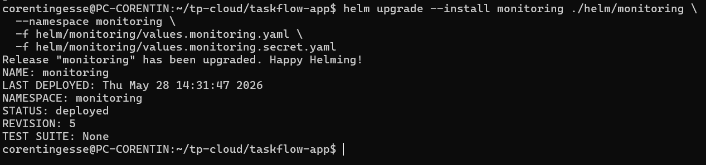

---

### Vérification dans Prometheus

```bash
kubectl port-forward -n monitoring svc/monitoring-kube-prometheus-prometheus 9090:9090
```

Sur **http://localhost:9090/targets**, les 4 services TaskFlow apparaissent bien avec l'état `up` :

| ServiceMonitor | Targets | État |
|---|---|---|
| `serviceMonitor/monitoring/notification-service/0` | 1/1 | ✅ up |
| `serviceMonitor/monitoring/task-service/0` | 2/2 | ✅ up |
| `serviceMonitor/monitoring/user-service/0` | 2/2 | ✅ up |
| `serviceMonitor/monitoring/api-gateway/0` | 2/2 | ✅ up |

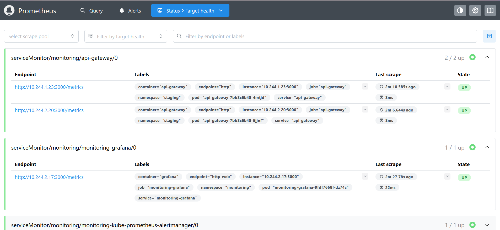
