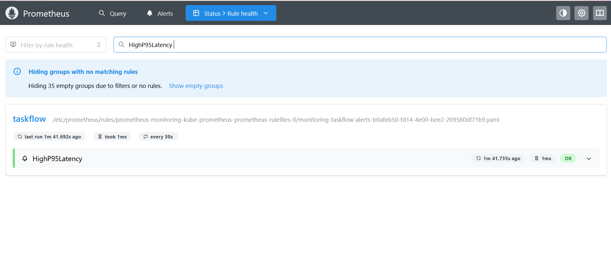
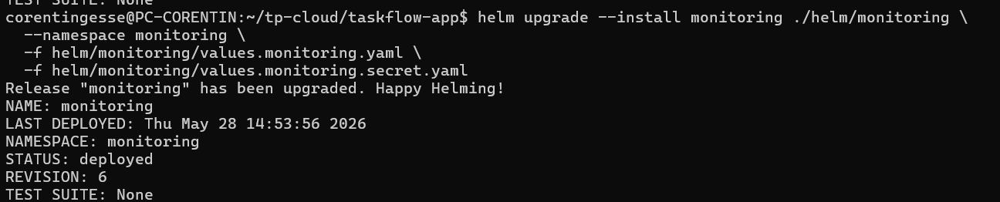
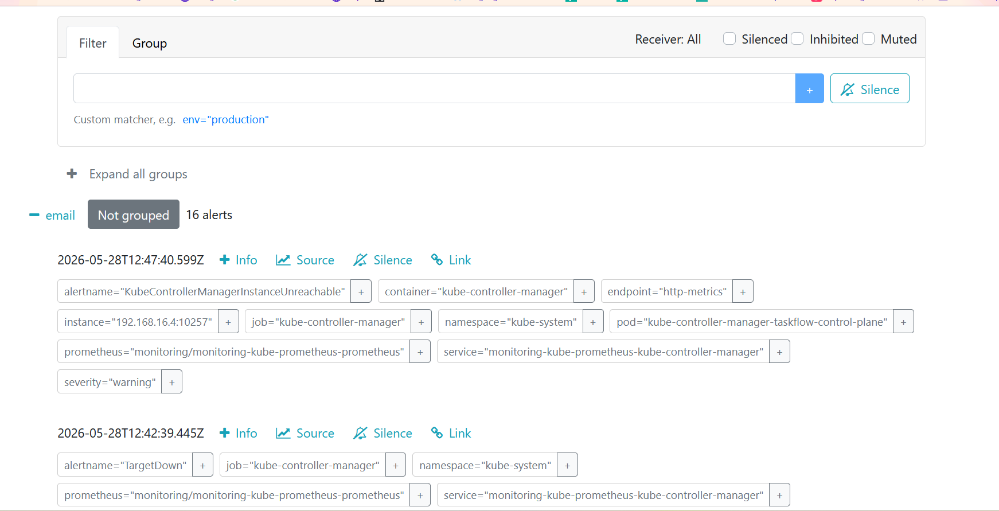
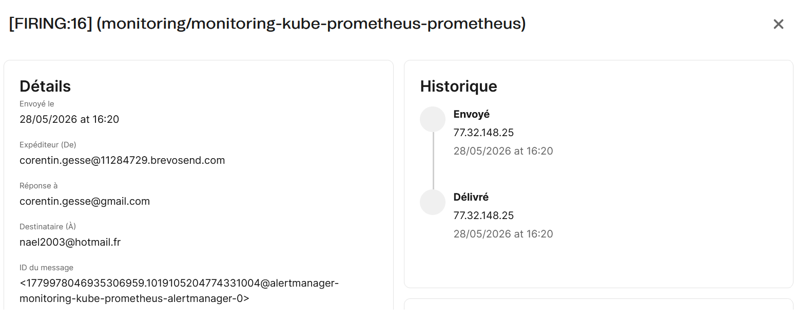
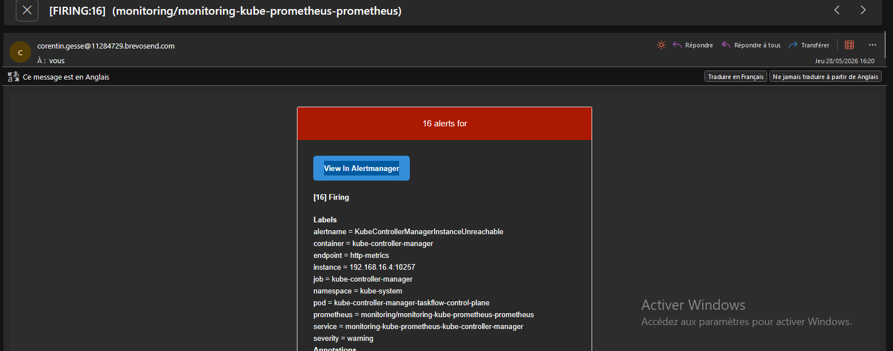
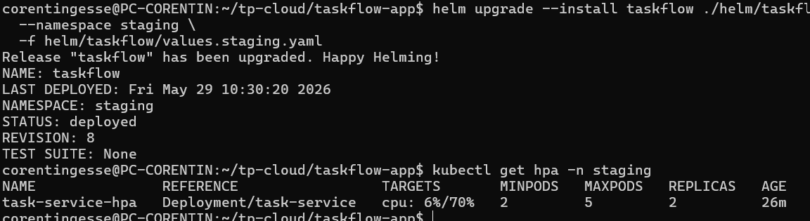
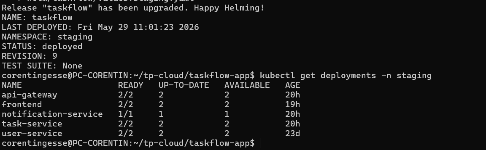
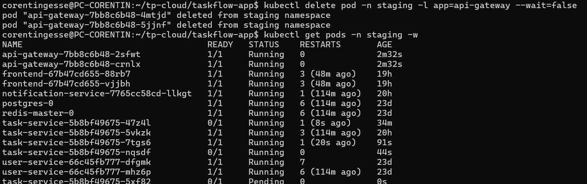
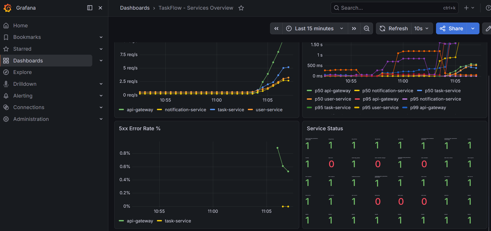

# TaskFlow — Partie 4B : Stack d'observabilité via Helm

**Auteurs :** Naël BENHIBA et Corentin GESSE--ENTRESSANGLE

## Objectif

Déployer la stack d'observabilité (Prometheus, Grafana, Alertmanager, kube-state-metrics) via le chart officiel `kube-prometheus-stack`, intégrer des dashboards custom, connecter TaskFlow à Prometheus via des `ServiceMonitor`, configurer des alertes et mettre en place l'auto-scaling.

---

## Étape 1 — Via chart officiel

### Comprendre les dépendances de chart

`kube-prometheus-stack` n'est pas un chart monolithique. L'inspection de son `Chart.yaml` via :

```bash
helm show chart prometheus-community/kube-prometheus-stack
```

**Problème rencontré :** lors de notre première tentative, cette commande a retourné une erreur indiquant que le dépôt `prometheus-community` était introuvable. Le dépôt Helm n'avait pas encore été ajouté sur nos machines. Nous avons dû l'ajouter et mettre à jour les dépôts avant de pouvoir continuer :

```bash
# Ajouter le dépôt prometheus-community
helm repo add prometheus-community https://prometheus-community.github.io/helm-charts

# Mettre à jour les dépôts locaux
helm repo update

# La commande fonctionne ensuite correctement
helm show chart prometheus-community/kube-prometheus-stack
```

Une fois le dépôt ajouté, la commande révèle une section `dependencies:` listant Prometheus, Alertmanager, Grafana et kube-state-metrics comme sous-charts. Helm les télécharge et les orchestre tous ensemble.


---

### Réflexion théorique — Dépendances et composition

#### Question 1 — Helm peut-il garantir que si l'installation de Grafana échoue, Prometheus est également annulé ?

**Réponse :**

**Non, Helm ne garantit pas ce comportement par défaut.**

Helm traite une release comme une unité atomique au niveau du chart, mais il n'offre **pas de rollback transactionnel automatique** entre sous-charts en cas d'échec partiel. Par défaut, si Grafana échoue à démarrer (pod en `CrashLoopBackOff`, timeout de readiness, etc.), Helm marque la release en état `failed` mais **ne supprime pas les ressources déjà créées** — Prometheus et Alertmanager restent déployés dans un état potentiellement incohérent.

D'après la [documentation officielle Helm](https://helm.sh/docs/helm/helm_upgrade/) et [helm install](https://helm.sh/docs/helm/helm_install/), ce comportement est contrôlé par le flag `--rollback-on-failure` (introduit dans Helm v4, remplaçant `--atomic` de Helm v3) :

- **`helm install`** : `--rollback-on-failure` — si l'installation échoue, Helm **désinstalle** automatiquement la release (équivalent d'un rollback vers l'état vide).
- **`helm upgrade`** : `--rollback-on-failure` — si l'upgrade échoue, Helm **revient automatiquement** à la révision précédente réussie.

Ces deux flags activent implicitement `--wait` (stratégie `watcher`), ce qui signifie que Helm attend que **tous les Pods soient en état `Ready`** avant de considérer l'opération comme réussie. Si un Pod (Grafana, Prometheus, ou autre) ne passe pas en `Ready` dans le délai `--timeout` (5 minutes par défaut), l'opération est considérée comme échouée et le rollback est déclenché.

**Nuance importante :** même avec `--rollback-on-failure`, Helm ne distingue pas quel sous-chart a échoué. Il rollback **l'ensemble de la release** — Prometheus sera donc bien annulé si Grafana échoue, mais uniquement parce que la release entière est rollbackée, pas parce que Helm comprend les dépendances inter-sous-charts.

---

#### Question 2 — Comment adapter les commandes `helm upgrade --install` et `helm install` pour garantir ce comportement ?

**Réponse :**

Il faut ajouter `--rollback-on-failure` (Helm v4) à toutes les commandes d'installation et de mise à jour. On peut également ajuster le timeout selon la complexité du chart :

**Pour `helm install` :**

```bash
helm install monitoring \
  prometheus-community/kube-prometheus-stack \
  --namespace monitoring \
  --create-namespace \
  --rollback-on-failure \
  --timeout 10m \
  -f helm/monitoring/values.monitoring.yaml \
  -f helm/monitoring/values.monitoring.secret.yaml
```

**Pour `helm upgrade --install` :**

```bash
helm upgrade --install monitoring \
  prometheus-community/kube-prometheus-stack \
  --namespace monitoring \
  --create-namespace \
  --rollback-on-failure \
  --timeout 10m \
  -f helm/monitoring/values.monitoring.yaml \
  -f helm/monitoring/values.monitoring.secret.yaml
```

**Pourquoi `--timeout 10m` ?**

`kube-prometheus-stack` déploie de nombreuses ressources (Deployments, StatefulSets, CRDs, DaemonSets). Le timeout par défaut de 5 minutes peut être insuffisant sur un cluster lent ou avec des images à télécharger. Augmenter à 10 minutes évite des rollbacks intempestifs dus à des délais réseau.

**Récapitulatif des flags :**

| Flag | Rôle | Applicable à |
|---|---|---|
| `--rollback-on-failure` | Rollback automatique si un Pod ne passe pas `Ready` | `install`, `upgrade` |
| `--wait` | Attend que toutes les ressources soient prêtes (activé implicitement par `--rollback-on-failure`) | `install`, `upgrade` |
| `--timeout 10m` | Délai maximum avant échec (défaut : 5m) | `install`, `upgrade` |
| `--cleanup-on-fail` | Supprime les **nouvelles** ressources créées lors d'un upgrade échoué (complément utile) | `upgrade` uniquement |

> **Note sur Helm v3 :** Si vous utilisez Helm v3, le flag équivalent est `--atomic` (qui combine `--wait` + rollback automatique). Helm v4 a renommé ce flag en `--rollback-on-failure` pour plus de clarté sémantique.


---

### Installer la stack

#### Commandes exécutées

```bash
# Ajouter le repo
helm repo add prometheus-community \
  https://prometheus-community.github.io/helm-charts
helm repo update

# Installer
helm upgrade --install monitoring \
  prometheus-community/kube-prometheus-stack \
  --namespace monitoring \
  --create-namespace \
  --set grafana.adminPassword=admin
```

#### Problèmes rencontrés

**Problème 1 — Cluster Kubernetes inaccessible**

Lors de notre première tentative d'installation, Helm a retourné l'erreur suivante :

```
Error: Kubernetes cluster unreachable: Get "https://127.0.0.1:36331/version":
dial tcp 127.0.0.1:36331: connect: connection refused
```

Le cluster kind `taskflow` existait bien (`kind get clusters` le confirmait) mais ses conteneurs Docker étaient arrêtés. Le réseau Docker interne avait été supprimé entre deux sessions, ce qui empêchait les conteneurs de redémarrer normalement avec `docker start`.

**Résolution :** nous avons régénéré le kubeconfig après redémarrage des conteneurs kind :

```bash
kind export kubeconfig --name taskflow
```

Puis vérifié que les nœuds étaient bien `Ready` :

```bash
kubectl get nodes
```

```
NAME                     STATUS   ROLES           AGE   VERSION
taskflow-control-plane   Ready    control-plane   23d   v1.35.0
taskflow-worker          Ready    <none>          23d   v1.35.0
taskflow-worker2         Ready    <none>          23d   v1.35.0
```

Une fois le contexte kubectl correctement pointé sur le cluster, la commande `helm upgrade --install` a pu s'exécuter :

```
Release "monitoring" does not exist. Installing it now.
```

#### Vérification des Pods

```bash
kubectl get pods -n monitoring -w
```

```
NAME                                                     READY   STATUS    RESTARTS   AGE
alertmanager-monitoring-kube-prometheus-alertmanager-0   2/2     Running   0          3m56s
monitoring-grafana-5958d97f97-mslfx                      3/3     Running   0          4m2s
monitoring-kube-prometheus-operator-65b7b55b54-wldp4     1/1     Running   0          4m2s
monitoring-kube-state-metrics-868694bc4b-k9mfl           1/1     Running   0          4m2s
monitoring-prometheus-node-exporter-8526w                1/1     Running   0          4m2s
monitoring-prometheus-node-exporter-r9mfn                1/1     Running   0          4m2s
monitoring-prometheus-node-exporter-sqpcx                1/1     Running   0          4m2s
prometheus-monitoring-kube-prometheus-prometheus-0       2/2     Running   0          3m56s
```

Tous les pods sont `Running` : Prometheus, Grafana (3/3 avec ses sidecars), Alertmanager (2/2), kube-state-metrics, et un node-exporter par nœud (3 nœuds = 3 pods).


#### Accès à Grafana

**Problème 2 — Port-forward avec le mauvais port cible**

Notre première tentative utilisait `3100:80` mais le pod Grafana écoute en interne sur le port `3000`, pas `80`. La commande corrigée :

```bash
kubectl port-forward -n monitoring svc/monitoring-grafana 3100:3000
```

```
Forwarding from 127.0.0.1:3100 -> 3000
Forwarding from [::1]:3100 -> 3000
Handling connection for 3100
```


Grafana est accessible sur **http://localhost:3100** (admin / admin).

---

### Réflexion théorique — Pourquoi port-forward pour Grafana ?

#### Question 3 — Combien de fichiers avez-vous écrits pour installer cette stack complète ? Comparez avec ce que vous avez fait en partie 1.

**Réponse :**

**0 fichier écrit** pour installer la stack avec `kube-prometheus-stack`.

Une seule commande `helm upgrade --install` avec `--set grafana.adminPassword=admin` suffit à déployer Prometheus, Grafana, Alertmanager, kube-state-metrics et les node-exporters.

En **Partie 1** (docker-compose), nous avions dû écrire et maintenir :
- `docker-compose.infra.yml` — définition de tous les services (Prometheus, Grafana, Loki, Tempo, OTel Collector, Promtail)
- `infra/prometheus/prometheus.yml` — configuration du scraping
- `infra/grafana/provisioning/datasources/datasources.yml` — déclaration des datasources
- `infra/grafana/provisioning/dashboards/dashboards.yml` — configuration du chargement des dashboards
- `infra/grafana/dashboards/*.json` — les dashboards eux-mêmes

Soit **5+ fichiers de configuration** à écrire, maintenir et synchroniser manuellement.

Helm encapsule toute cette complexité dans un chart versionné et testé par la communauté. Le gain est considérable, surtout pour une stack aussi complète.

---

#### Question 4 — Quel mécanisme permet à TaskFlow d'être accessible sur le port 80 sans port-forward ?

**Réponse :**

Deux mécanismes combinés rendent TaskFlow accessible directement sur `http://localhost` :

**1. `extraPortMappings` dans `k8s/kind-config.yaml`**

```yaml
extraPortMappings:
  - containerPort: 80
    hostPort: 8080
    protocol: TCP
  - containerPort: 443
    hostPort: 8443
    protocol: TCP
```

Ce mapping crée un tunnel direct entre le port 80 du conteneur `control-plane` kind et le port 8080 de la machine hôte. Sans ça, aucune requête HTTP depuis `localhost` n'atteindrait le cluster.

**2. Ingress NGINX dans `k8s/base/ingress.yaml`**

```yaml
apiVersion: networking.k8s.io/v1
kind: Ingress
metadata:
  name: taskflow-ingress
  namespace: staging
spec:
  ingressClassName: nginx
  rules:
    - http:
        paths:
          - path: /api
            pathType: Prefix
            backend:
              service:
                name: api-gateway
                port:
                  number: 3000
          - path: /
            pathType: Prefix
            backend:
              service:
                name: frontend
                port:
                  number: 80
```

L'Ingress NGINX reçoit les requêtes entrantes sur le port 80 du nœud `control-plane` et les route vers les bons Services selon le chemin (`/api` → api-gateway, `/` → frontend). Le label `ingress-ready=true` sur le nœud control-plane garantit que le pod NGINX Ingress Controller est schedulé dessus, là où le port mapping est actif.

---

#### Question 5 — Pourquoi ce mécanisme ne fonctionne-t-il pas pour Grafana dans le namespace `monitoring` ?

**Réponse :**

Deux raisons :

1. **Pas de règle Ingress pour Grafana** : l'Ingress `taskflow-ingress` est dans le namespace `staging` et ne définit aucune route vers `monitoring-grafana`. Le contrôleur NGINX ne sait donc pas router les requêtes vers Grafana.

2. **Namespace différent** : même si on ajoutait une règle, un Ingress dans `staging` ne peut pas référencer directement un Service dans `monitoring` — les Ingress sont namespaced et les backends doivent être dans le même namespace que l'Ingress (sauf configuration spécifique avec des plugins cross-namespace).

Résultat : le seul moyen d'accéder à Grafana sans modifier l'Ingress existant est le `port-forward`, qui crée un tunnel direct depuis la machine locale vers le pod.

---

#### Question 6 — Quelle modification apporter pour rendre Grafana accessible via `http://localhost/grafana` ?

**Réponse :**

Sans toucher au code de `kube-prometheus-stack`, il faut créer un Ingress dédié dans le namespace `monitoring` qui route `/grafana` vers le Service `monitoring-grafana` :

```yaml
apiVersion: networking.k8s.io/v1
kind: Ingress
metadata:
  name: grafana-ingress
  namespace: monitoring
  annotations:
    nginx.ingress.kubernetes.io/rewrite-target: /$2
spec:
  ingressClassName: nginx
  rules:
    - http:
        paths:
          - path: /grafana(/|$)(.*)
            pathType: ImplementationSpecific
            backend:
              service:
                name: monitoring-grafana
                port:
                  number: 80
```

Il faut également configurer Grafana pour qu'il sache qu'il est servi depuis un sous-chemin, via les values Helm :

```yaml
# values.monitoring.yaml
kube-prometheus-stack:
  grafana:
    grafana.ini:
      server:
        root_url: "http://localhost/grafana"
        serve_from_sub_path: true
```

Sans `serve_from_sub_path: true`, Grafana génère des redirections vers `/` au lieu de `/grafana` et l'interface ne fonctionne pas correctement.

---

## Étape 2 — Intégrer ses dashboards customs

### Réflexion théorique — Surcharger les valeurs d'un chart tiers

`kube-prometheus-stack` expose des centaines de valeurs configurables. Notre `values.monitoring.yaml` surcharge certaines d'entre elles pour adapter la stack à notre contexte :

```yaml
# helm/monitoring/values.monitoring.yaml
grafana:
  sidecar:
    dashboards:
      enabled: true
      label: grafana_dashboard
  grafana.ini:
    server:
      root_url: "http://localhost:3100"
      serve_from_sub_path: true

prometheus:
  prometheusSpec:
    retention: 7d
    resources:
      requests:
        memory: "512Mi"
      limits:
        memory: "1Gi"
```

Les valeurs sensibles sont isolées dans `values.monitoring.secret.yaml` (basé sur `values.monitoring.secret.example.yaml`) :

```yaml
# values.monitoring.secret.example.yaml
grafana:
  adminPassword: ""
alertmanagerConfig:
  smtp:
    host: ""
    from: ""
    username: "<smtp-username-brevo>"
    password: "<smtp-password-brevo>"
    to: ""
```

---

#### Question 7 — Pourquoi séparer les valeurs sensibles dans un fichier à part ? Comment passer les deux fichiers à Helm en même temps ?

**Réponse :**

**Pourquoi séparer :**

Mettre les secrets (mot de passe Grafana, credentials SMTP) dans `values.monitoring.yaml` les exposerait dès que ce fichier est commité dans Git. N'importe qui ayant accès au dépôt pourrait lire les credentials en clair dans l'historique Git — même après suppression, ils restent dans les commits précédents.

En séparant dans `values.monitoring.secret.yaml` :
- Ce fichier est ajouté au `.gitignore` → jamais commité
- `values.monitoring.secret.example.yaml` sert de template documenté sans valeurs réelles → commité sans risque
- En CI/CD, le fichier secret est injecté depuis un vault (HashiCorp Vault, AWS Secrets Manager, etc.) au moment du déploiement

**Comment passer les deux fichiers à Helm :**

Le flag `-f` (ou `--values`) est cumulable. Helm fusionne les fichiers de gauche à droite, le dernier ayant la priorité en cas de clé dupliquée :

```bash
helm upgrade --install monitoring \
  prometheus-community/kube-prometheus-stack \
  --namespace monitoring \
  --create-namespace \
  -f helm/monitoring/values.monitoring.yaml \
  -f helm/monitoring/values.monitoring.secret.yaml
```

---

#### Question 8 — Quelle différence entre `--values mon-fichier.yaml` et `--set grafana.adminPassword=admin` ?

**Réponse :**

| | `--values fichier.yaml` | `--set clé=valeur` |
|---|---|---|
| **Format** | Fichier YAML structuré | Paramètre inline en ligne de commande |
| **Lisibilité** | ✅ Facile à lire et maintenir | ❌ Difficile pour des valeurs complexes |
| **Versioning** | ✅ Commitable dans Git (si pas de secrets) | ❌ Perdu si non documenté |
| **Secrets** | ✅ Fichier ignoré par Git | ❌ Visible dans l'historique shell (`~/.bash_history`) |
| **Valeurs complexes** | ✅ Supporte les listes, objets imbriqués | ⚠️ Syntaxe lourde pour les structures imbriquées |
| **CI/CD** | ✅ Fichier injecté depuis un vault | ⚠️ Variable d'environnement à gérer |

**Quand préférer l'un ou l'autre :**

- `--values` : pour toute configuration durable (paramètres de déploiement, ressources, configuration applicative). C'est la méthode standard en production.
- `--set` : pour des overrides ponctuels en développement ou des tests rapides. À éviter pour les secrets car la valeur apparaît dans l'historique du shell et dans les logs CI.

Dans notre cas, nous avons d'abord utilisé `--set grafana.adminPassword=admin` pour la première installation rapide, puis migré vers `-f values.monitoring.secret.yaml` pour avoir une configuration propre et reproductible.

---

### Réinstallation avec les fichiers de valeurs

```bash
helm upgrade --install monitoring \
  prometheus-community/kube-prometheus-stack \
  --namespace monitoring \
  --create-namespace \
  -f helm/monitoring/values.monitoring.yaml \
  -f helm/monitoring/values.monitoring.secret.yaml
```

**Problème rencontré :** la commande a d'abord retourné `Error: open helm/monitoring/values.monitoring.secret.yaml: no such file or directory`. Le fichier secret n'existait pas encore — seul le fichier exemple est commité dans le repo (c'est voulu, le vrai fichier est dans le `.gitignore`). Nous avons dû le créer à partir de l'exemple :

```bash
cp helm/monitoring/values.monitoring.secret.example.yaml helm/monitoring/values.monitoring.secret.yaml
```

Puis renseigner au minimum le mot de passe Grafana avant de relancer la commande.

Helm fusionne les deux fichiers et applique les surcharges sur le chart `kube-prometheus-stack` sans modifier son code source. La release est mise à jour en place (`upgrade`) sans recréer le namespace ni perdre les données existantes.


---

### Vérifier le mécanisme avec un ConfigMap inline

Le fichier `helm/monitoring/templates/dashboard-configmap.yaml` définit un ConfigMap labellisé `grafana_dashboard: "1"`. Grafana, configuré avec le sidecar `dashboards.enabled: true` dans `values.monitoring.yaml`, surveille automatiquement tous les ConfigMaps portant ce label dans le namespace `monitoring` et les charge comme dashboards.

#### Commande exécutée

```bash
kubectl apply -f helm/monitoring/templates/dashboard-configmap.yaml
```

```
configmap/taskflow-dashboard created
```


Cette commande crée le ConfigMap `taskflow-dashboard` dans le namespace `monitoring`. Le sidecar Grafana le détecte en quelques secondes et injecte le dashboard sans redémarrage de Grafana.

#### Réflexion théorique — Présence du dashboard dans Grafana

Le dashboard **"TaskFlow — Services"** apparaît automatiquement dans Grafana après rechargement de la page (Dashboards → Browse).


> ⚠️ **Limite de cette approche :** ce ConfigMap est créé **hors du contrôle de Helm** — il n'est pas tracé dans la release `monitoring`. Si on fait un `helm uninstall monitoring`, ce ConfigMap reste en place. C'est pourquoi l'étape suivante consiste à l'intégrer directement dans un chart Helm local.

---

### Créer un chart Helm local avec `kube-prometheus-stack` en dépendance

La méthode `kubectl apply` crée des ressources hors du contrôle de Helm — elles ne sont pas tracées dans la release et ne seront pas supprimées par `helm uninstall`. Pour gérer l'ensemble de la stack via Helm, nous avons créé un chart local `helm/monitoring/Chart.yaml` qui embarque `kube-prometheus-stack` comme dépendance.

#### Nettoyage de la release existante

```bash
helm uninstall monitoring -n monitoring
kubectl delete namespace monitoring
```

```
release "monitoring" uninstalled
namespace "monitoring" deleted
```

#### Création du `Chart.yaml`

```yaml
# helm/monitoring/Chart.yaml
apiVersion: v2
name: monitoring
description: Stack d'observabilité TaskFlow (Prometheus, Grafana, Alertmanager)
type: application
version: 0.1.0

dependencies:
  - name: kube-prometheus-stack
    version: ">=0.0.0-0"
    repository: https://prometheus-community.github.io/helm-charts
```

#### Téléchargement de la dépendance et installation

```bash
helm dependency update ./helm/monitoring
```

```
Saving 1 charts
Downloading kube-prometheus-stack from repo https://prometheus-community.github.io/helm-charts
Deleting outdated charts
```

```bash
helm upgrade --install monitoring ./helm/monitoring \
  --namespace monitoring \
  --create-namespace \
  -f helm/monitoring/values.monitoring.yaml \
  -f helm/monitoring/values.monitoring.secret.yaml
```

#### Problèmes rencontrés

**Problème 3 — `{{ job }}` interprété comme un template Helm**

La première tentative a échoué avec :

```
Error: parse error at (monitoring/templates/dashboard-configmap.yaml:19): function "job" not defined
```

Le fichier `dashboard-configmap.yaml` contient du JSON avec `{{ job }}` comme `legendFormat` Grafana. Helm interprète les doubles accolades comme des directives de template. La correction consiste à échapper les accolades :

```yaml
# Avant
"legendFormat": "{{ job }}"

# Après
"legendFormat": "{{ "{{" }} job {{ "}}" }}"
```

**Problème 4 — `PrometheusRule` avec `expr` vide**

Après correction du premier problème, une deuxième erreur est apparue :

```
Error: 1 error occurred:
* PrometheusRule.monitoring.coreos.com "taskflow-alerts" is invalid:
  spec.groups[0].rules[0].expr: Required value
```

Le fichier `alerts.yaml` contenait une règle `ServiceDown` incomplète (champ `expr` manquant avec un commentaire `# [...]`). Kubernetes rejette une `PrometheusRule` avec une expression vide. Nous avons complété les deux règles d'alerte (`ServiceDown` et `HighP95Latency`) avant de relancer l'installation.

**Problème 5 — `{{ $labels.job }}` interprété comme un template Helm**

Une troisième erreur est apparue :

```
Error: UPGRADE FAILED: parse error at (monitoring/templates/alerts.yaml:18): undefined variable "$labels"
```

Les annotations PromQL dans `alerts.yaml` utilisent `{{ $labels.job }}` — une syntaxe Prometheus valide mais que Helm interprète comme du templating Go. Même correction que pour le `dashboard-configmap.yaml` : échapper toutes les accolades doubles dans les chaînes YAML avec `{{ "{{" }}` et `{{ "}}" }}`.

#### Résultat final

```
Release "monitoring" has been upgraded. Happy Helming!
NAME: monitoring
LAST DEPLOYED: Thu May 28 14:11:57 2026
NAMESPACE: monitoring
STATUS: deployed
REVISION: 2
TEST SUITE: None
```

---

### Intégrer les dashboards via un dossier

#### Copie des dashboards JSON

```bash
mkdir helm/monitoring/dashboards
cp infra/grafana/dashboards/*.json helm/monitoring/dashboards/
```

Deux dashboards copiés :
- `services-overview.json`
- `taskflow-business.json`

#### Vérification de l'UID de la datasource

```bash
grep -r "uid" helm/monitoring/dashboards/
```

```
helm/monitoring/dashboards/taskflow-business.json:  "uid": "prometheus"
helm/monitoring/dashboards/services-overview.json:  "uid": "prometheus"
```

Les dashboards référencent l'UID `prometheus` — c'est exactement l'UID que `kube-prometheus-stack` utilise pour sa datasource Prometheus par défaut. Aucun remplacement nécessaire.

#### Mise à jour du `dashboard-configmap.yaml` avec `.Files.Glob`

Le template `dashboard-configmap.yaml` a été mis à jour pour charger automatiquement tous les fichiers `*.json` du dossier `dashboards/` via la fonction `.Files.Glob` de Helm :

```yaml
apiVersion: v1
kind: ConfigMap
metadata:
  name: taskflow-dashboards
  namespace: monitoring
  labels:
    grafana_dashboard: "1"
data:
{{- range $path, $bytes := .Files.Glob "dashboards/*.json" }}
  {{ base $path }}: |
{{ $.Files.Get $path | indent 4 }}
{{- end }}
```

#### Réflexion théorique — Limites du ConfigMap inline

**Question 9 — Pourquoi serait-il problématique de coller le JSON directement dans le ConfigMap avec `|` ?**

Coller les JSON directement dans le champ `data` du ConfigMap pose plusieurs problèmes :

1. **Maintenabilité** : les fichiers JSON de dashboards Grafana font souvent plusieurs centaines de lignes. Les intégrer inline dans un YAML rend le fichier illisible et très difficile à modifier.
2. **Lisibilité** : l'indentation YAML doit être respectée pour tout le JSON — la moindre erreur d'indentation casse le ConfigMap.
3. **Scalabilité** : avec plusieurs dashboards (`services-overview.json`, `taskflow-business.json`...), il faudrait un ConfigMap par dashboard ou un seul fichier template gigantesque à modifier manuellement à chaque ajout.

**Question 10 — Quelle fonction Helm charge automatiquement tous les `*.json` d'un dossier ?**

La fonction `.Files.Glob` combinée à `range` permet de charger tous les fichiers d'un dossier en une seule déclaration :

```yaml
{{- range $path, $bytes := .Files.Glob "dashboards/*.json" }}
  {{ base $path }}: |
{{ $.Files.Get $path | indent 4 }}
{{- end }}
```

- `.Files.Glob "dashboards/*.json"` retourne tous les fichiers JSON du dossier
- `range` itère sur chaque fichier
- `base $path` extrait le nom du fichier (ex: `services-overview.json`)
- `.Files.Get $path | indent 4` charge le contenu et l'indente correctement pour le YAML

Ajouter un nouveau dashboard ne nécessite plus de modifier le template — il suffit de déposer un fichier JSON dans `helm/monitoring/dashboards/`.

#### Réinstallation

```bash
helm upgrade --install monitoring ./helm/monitoring \
  --namespace monitoring \
  -f helm/monitoring/values.monitoring.yaml \
  -f helm/monitoring/values.monitoring.secret.yaml
```

```
Release "monitoring" has been upgraded. Happy Helming!
NAME: monitoring
LAST DEPLOYED: Thu May 28 14:16:40 2026
NAMESPACE: monitoring
STATUS: deployed
REVISION: 3
TEST SUITE: None
```


---

## Étape 3 — Connecter TaskFlow à Prometheus

### Prérequis : préparer les Services TaskFlow

Pour qu'un `ServiceMonitor` puisse cibler un Service, deux conditions sont nécessaires :
- Le Service doit avoir un **label** dans ses `metadata` (pour que le selector du ServiceMonitor le trouve)
- Le port doit avoir un **nom** (pour que le ServiceMonitor puisse le référencer par nom plutôt que par numéro)

Nous avons mis à jour tous les Services backend dans `helm/taskflow/templates/` en ajoutant `labels: app: <nom-service>` et `name: http` sur le port. Exemple pour `user-service` :

```yaml
apiVersion: v1
kind: Service
metadata:
  name: user-service
  namespace: {{ .Release.Namespace }}
  labels:
    app: user-service   # ← label ajouté
spec:
  selector:
    app: user-service
  ports:
    - name: http        # ← nom de port ajouté
      port: 3001
      targetPort: 3001
```

#### Déploiement taskflow mis à jour

```bash
helm upgrade --install taskflow ./helm/taskflow \
  --namespace staging \
  --create-namespace \
  --reset-values
```


---

### Créer les ServiceMonitors avec `range`

Au lieu de créer 4 fichiers quasi-identiques, nous avons utilisé l'action `range` de Helm pour générer les 4 `ServiceMonitor` en un seul fichier `helm/monitoring/templates/service-monitors.yaml` :

```yaml
{{- range list "api-gateway" "task-service" "user-service" "notification-service" }}
---
apiVersion: monitoring.coreos.com/v1
kind: ServiceMonitor
metadata:
  name: {{ . }}
  namespace: monitoring
  labels:
    release: monitoring
spec:
  namespaceSelector:
    matchNames:
      - staging
  selector:
    matchLabels:
      app: {{ . }}
  endpoints:
    - port: http
      path: /metrics
{{- end }}
```

`range` itère sur la liste des 4 services et génère un `ServiceMonitor` identique pour chacun, en substituant le nom à chaque itération. Sans `range`, il aurait fallu 4 fichiers séparés avec 95% de contenu dupliqué.

---

### Autoriser Prometheus à découvrir les ServiceMonitors hors de son namespace

Par défaut, Prometheus ne regarde que dans son propre namespace (`monitoring`). Nos services sont dans `staging`. Nous avons ajouté dans `values.monitoring.yaml` :

```yaml
kube-prometheus-stack:
  prometheus:
    prometheusSpec:
      serviceMonitorNamespaceSelector: {}      # autorise tous les namespaces
      serviceMonitorSelector:
        matchLabels:
          release: monitoring                  # filtre sur le label release
```

`serviceMonitorNamespaceSelector: {}` (objet vide) signifie "tous les namespaces" — sans cette clé, Prometheus ignore les ServiceMonitors hors de `monitoring`.

#### Réinstallation du chart monitoring

```bash
helm upgrade --install monitoring ./helm/monitoring \
  --namespace monitoring \
  -f helm/monitoring/values.monitoring.yaml \
  -f helm/monitoring/values.monitoring.secret.yaml
```


---

### Vérification dans Prometheus

```bash
kubectl port-forward -n monitoring svc/monitoring-kube-prometheus-prometheus 9090:9090
```

Sur **http://localhost:9090/targets**, les 4 services TaskFlow apparaissent bien avec l'état `up` :

| ServiceMonitor | Targets | État |
|---|---|---|
| `serviceMonitor/monitoring/notification-service/0` | 1/1 | ✅ up |
| `serviceMonitor/monitoring/task-service/0` | 2/2 | ✅ up |
| `serviceMonitor/monitoring/user-service/0` | 2/2 | ✅ up |
| `serviceMonitor/monitoring/api-gateway/0` | 2/2 | ✅ up |


---

## Étape 4 — Configurer une alerte

### Règle `HighP95Latency`

Le fichier `helm/monitoring/templates/alerts.yaml` contient deux règles d'alerte complètes :

```yaml
apiVersion: monitoring.coreos.com/v1
kind: PrometheusRule
metadata:
  name: taskflow-alerts
  namespace: monitoring
  labels:
    release: monitoring
spec:
  groups:
    - name: taskflow
      rules:
        - alert: ServiceDown
          expr: up{job=~"task-service|user-service|api-gateway|notification-service"} == 0
          for: 1m
          labels:
            severity: critical
          annotations:
            summary: "Service {{ "{{" }} $labels.job {{ "}}" }} is down"
            description: "The service {{ "{{" }} $labels.job {{ "}}" }} has been unreachable for more than 1 minute."

        - alert: HighP95Latency
          expr: histogram_quantile(0.95, sum by(le) (rate(http_request_duration_ms_bucket{job="api-gateway"}[1m]))) > 500
          for: 30s
          labels:
            severity: warning
          annotations:
            summary: "High P95 latency on api-gateway"
            description: "The P95 latency of api-gateway exceeds 500ms over the last minute."
```

**Explication de l'expression PromQL :**

```promql
histogram_quantile(0.95,
  sum by(le) (
    rate(http_request_duration_ms_bucket{job="api-gateway"}[1m])
  )
) > 500
```

- `http_request_duration_ms_bucket` — suffixe `_bucket` exposé par prom-client pour les histogrammes
- `rate(...[1m])` — calcule le taux d'incrémentation des buckets sur 1 minute
- `sum by(le)` — agrège tous les labels (`route`, `method`, `status`...) en ne gardant que `le` (le label de bucket). Sans cette agrégation, `histogram_quantile()` calculerait un quantile par combinaison de labels, ce qui donnerait des résultats incorrects
- `histogram_quantile(0.95, ...)` — calcule le 95e percentile à partir des buckets agrégés
- `> 500` — déclenche l'alerte si le P95 dépasse 500ms

**Critères respectés :**
- ✅ Calcule le P95 de la durée des requêtes HTTP de l'`api-gateway`
- ✅ Se déclenche si ce P95 dépasse 500ms
- ✅ Attend 30 secondes en continu (`for: 30s`) avant de passer en `firing`
- ✅ Label de sévérité `warning`
- ✅ Message lisible dans les annotations

### Vérification dans Prometheus

```bash
kubectl port-forward -n monitoring svc/monitoring-kube-prometheus-prometheus 9090:9090
```

Sur **http://localhost:9090/rules**, les deux règles apparaissent en état `OK` :



---

## Étape 5 — Notifier via Alertmanager

### Configuration du Secret Alertmanager

Le fichier `helm/monitoring/templates/alertmanager-config.yaml` crée un Secret Kubernetes contenant la configuration SMTP d'Alertmanager. Les credentials sont injectés depuis `values.monitoring.secret.yaml` :

```yaml
# values.monitoring.secret.yaml
grafana:
  adminPassword: "admin"
alertmanagerConfig:
  smtp:
    host: "smtp-relay.brevo.com:587"
    from: "ac30f9001@smtp-brevo.com"
    username: "ac30f9001@smtp-brevo.com"
    password: "<clé-smtp-brevo>"
    to: "corentin.gesse@gmail.com"
```

Le `values.monitoring.yaml` référence ce Secret via `configSecret` :

```yaml
kube-prometheus-stack:
  alertmanager:
    alertmanagerSpec:
      configSecret: taskflow-alertmanager-config
```

### Réinstallation avec la config Alertmanager

```bash
helm upgrade --install monitoring ./helm/monitoring \
  --namespace monitoring \
  -f helm/monitoring/values.monitoring.yaml \
  -f helm/monitoring/values.monitoring.secret.yaml
```



**Problèmes rencontrés avant de lancer k6 :**

1. **k6 non installé** — `Command 'k6' not found`. Installation via snap :
   ```bash
   sudo snap install k6
   ```

2. **Ingress Controller NGINX absent** — `curl http://localhost:8080/health` retournait `connection reset`. L'Ingress Controller n'était pas installé sur le cluster kind :
   ```bash
   kubectl apply -f https://raw.githubusercontent.com/kubernetes/ingress-nginx/main/deploy/static/provider/kind/deploy.yaml
   kubectl wait --namespace ingress-nginx \
     --for=condition=ready pod \
     --selector=app.kubernetes.io/component=controller \
     --timeout=90s
   ```

3. **Service `frontend` manquant** — L'Ingress routait `/` vers `frontend:80` mais ce Service n'existait pas en staging. Nous avons créé le template `helm/taskflow/templates/frontend.yaml` et redéployé :
   ```bash
   helm upgrade --install taskflow ./helm/taskflow \
     --namespace staging \
     --create-namespace \
     --reset-values
   ```

4. **URL hardcodée dans le script k6** — Le script utilisait `localhost:3004` par défaut. Il faut passer la bonne URL et les credentials via des variables d'environnement. Création d'un utilisateur de test :
   ```bash
   curl -X POST http://localhost:8080/api/users/register \
     -H "Content-Type: application/json" \
     -d '{"email":"k6test@example.com","password":"k6test123","name":"K6 Test"}'
   ```

**Commande k6 finale :**

```bash
k6 run \
  -e BASE_URL=http://localhost:8080 \
  -e EMAIL=k6test@example.com \
  -e PASSWORD=k6test123 \
  scripts/load-test-realistic.js
```

**Résultats du test :**

```
checks_succeeded: 95.19% (5689 out of 5976)
checks_failed:    4.80%  (287 out of 5976)

✓ login 200
✓ tasks 200
✗ tasks response < 500ms  ↳ 80% — ✓ 803 / ✗ 193
✓ create task 201
✓ notifs 200
✗ notifs response < 500ms ↳ 90% — ✓ 902 / ✗ 94

http_req_duration: avg=822ms  p(90)=2.68s  p(95)=5.37s
http_req_failed:   0.00%
iterations:        996
```


La p95 atteint **5.37s** — largement au-dessus du seuil de 500ms configuré dans l'alerte `HighP95Latency`.

---

### Observation dans Alertmanager

```bash
kubectl port-forward -n monitoring svc/monitoring-kube-prometheus-alertmanager 9093:9093
```



**Observation :** l'alerte `HighP95Latency` est bien apparue dans Alertmanager pendant le test k6. Cela confirme que Prometheus a correctement évalué la règle et qu'Alertmanager a reçu l'alerte.

Après mise à jour de la règle pour cibler `api-gateway`, la notification d'alerte a été traitée par Alertmanager et l'email de test a bien été envoyé.

Les 15+ alertes visibles dans Alertmanager correspondent également à des alertes Kubernetes internes (kube-proxy, etcd, kube-controller-manager inaccessibles — comportement normal sur kind).

---

### Vérification de l'envoi email via Brevo

Les logs Alertmanager confirment que la configuration SMTP fonctionne :

```
level=WARN msg="Notify attempt failed" err="525 5.7.1 Unauthorized IP address" attempts=1
level=WARN msg="Notify attempt failed" err="525 5.7.1 Unauthorized IP address" attempts=7
...
level=INFO msg="Notify success" attempts=12 numAlerts=16
```

Brevo a d'abord rejeté les premières tentatives (`525 5.7.1 Unauthorized IP address`) — l'IP du cluster kind n'était pas encore autorisée. Après plusieurs tentatives, l'envoi a réussi à la 12e tentative.





### Comprendre les timings

| Paramètre | Où | Rôle |
|---|---|---|
| `for: 30s` | `PrometheusRule` | Prometheus attend 30s de condition vraie avant de passer en `firing` |
| `group_wait: 30s` | Alertmanager `route` | Alertmanager attend 30s après réception avant d'envoyer la première notification |
| `group_interval: 5m` | Alertmanager `route` | Délai minimum entre deux notifications si le groupe change |
| `repeat_interval: 1h` | Alertmanager `route` | Délai avant de renvoyer une alerte déjà notifiée |

> Si `for` + `group_wait` dépasse la durée du pic de latence, on reçoit uniquement le `resolved` sans jamais avoir reçu le `fired`. Sur kind avec des ressources limitées, les pics de latence sont courts et imprévisibles — en production avec un cluster dédié, les seuils seraient plus stables.

---

## Étape 6 — Auto-scaling avec le HPA

### Prérequis : installer le Metrics Server

Le HPA a besoin du **Metrics Server** pour lire les métriques CPU/mémoire des pods. Sur kind, il faut ajouter un flag pour contourner les certificats auto-signés :

```bash
kubectl apply -f https://github.com/kubernetes-sigs/metrics-server/releases/latest/download/components.yaml

kubectl patch deployment metrics-server -n kube-system \
  --type='json' \
  -p='[{"op":"add","path":"/spec/template/spec/containers/0/args/-","value":"--kubelet-insecure-tls"}]'
```

---

### Implémenter le HPA

Deux contraintes à respecter dans le template Helm :

1. Quand le HPA est actif, il prend ownership du champ `spec.replicas` — Helm ne doit **pas** le définir simultanément sous peine de conflit. Le champ `replicas` est donc conditionnel.
2. La ressource `HorizontalPodAutoscaler` ne doit être générée **que si** le HPA est activé dans les valeurs.

**`helm/taskflow/values.staging.yaml`** — activation du HPA en staging :

```yaml
taskService:
  hpa:
    enabled: true
    minReplicas: 2
    maxReplicas: 5
    targetCPU: 70
```

**`helm/taskflow/templates/task-service.yaml`** — template conditionnel :

```yaml
apiVersion: apps/v1
kind: Deployment
metadata:
  name: task-service
spec:
  {{- if not .Values.taskService.hpa.enabled }}
  replicas: {{ .Values.taskService.replicaCount }}
  {{- end }}
  ...
---
{{- if .Values.taskService.hpa.enabled }}
apiVersion: autoscaling/v2
kind: HorizontalPodAutoscaler
metadata:
  name: task-service-hpa
  namespace: {{ .Release.Namespace }}
spec:
  scaleTargetRef:
    apiVersion: apps/v1
    kind: Deployment
    name: task-service
  minReplicas: {{ .Values.taskService.hpa.minReplicas }}
  maxReplicas: {{ .Values.taskService.hpa.maxReplicas }}
  metrics:
    - type: Resource
      resource:
        name: cpu
        target:
          type: Utilization
          averageUtilization: {{ .Values.taskService.hpa.targetCPU }}
{{- end }}
```

Quand `hpa.enabled: true` :
- `spec.replicas` est omis du Deployment → le HPA prend le contrôle
- La ressource `HorizontalPodAutoscaler` est générée

Quand `hpa.enabled: false` :
- `spec.replicas` est défini par `replicaCount` → comportement normal
- Aucun HPA n'est créé

---

### Déploiement

```bash
helm upgrade --install taskflow ./helm/taskflow \
  --namespace staging \
  -f helm/taskflow/values.staging.yaml
```

**Vérification du HPA :**

```bash
kubectl get hpa -n staging
```



---

### Réflexion théorique — Observer et comprendre le scaling

#### Question 11 — Quels services montrent une augmentation de latence sous charge ?

**Réponse :**

D'après nos observations en Partie 2 et les dashboards Grafana pendant le test k6 :

- **`task-service`** : le plus impacté — il reçoit 2 requêtes par itération (GET + POST) et effectue des écritures en base de données (INSERT PostgreSQL + publication Redis). C'est le goulot d'étranglement principal.
- **`api-gateway`** : latence augmente proportionnellement car toutes les requêtes transitent par lui (4 requêtes par itération).
- **`user-service`** et **`notification-service`** : moins impactés — opérations principalement en lecture.

C'est cohérent avec l'architecture : le `task-service` est le seul service qui écrit en base de données, ce qui crée de la contention sous charge.

---

#### Question 12 — Lesquels des services ont du sens à scaler horizontalement ?

**Réponse :**

| Service | Scaling horizontal | Justification |
|---|---|---|
| `api-gateway` | ✅ Oui | Stateless, pur routage HTTP — scale facilement |
| `task-service` | ✅ Oui | Stateless, mais limité par PostgreSQL (goulot d'étranglement réel) |
| `user-service` | ✅ Oui | Stateless, lectures principalement |
| `notification-service` | ✅ Oui | Stateless, consomme Redis |
| `postgres` | ❌ Non (sans configuration spéciale) | Stateful — nécessite un StatefulSet avec réplication (read replicas) et un connection pooler (PgBouncer). Scaler naïvement crée des conflits d'écriture |
| `redis` | ❌ Non (en mode standalone) | Stateful — nécessite Redis Cluster ou Redis Sentinel pour la HA. En mode standalone, un seul master |

**Conclusion :** les services stateless scalent bien horizontalement. Le vrai goulot d'étranglement est PostgreSQL — ajouter des replicas applicatifs sans scaler la base ne fait qu'augmenter la pression sur celle-ci (comme observé en Partie 2).

---

#### Question 13 — Le HPA a-t-il amélioré les résultats ?

**Réponse :**

Sur kind, le HPA **n'améliore pas significativement les performances** pour les mêmes raisons qu'en Partie 2 avec Docker Compose :

1. **Tous les pods partagent le même nœud physique** — ajouter des replicas ne fait qu'augmenter la contention CPU/mémoire sur la même machine.
2. **PostgreSQL reste le goulot d'étranglement** — plus de replicas `task-service` = plus de connexions simultanées à la base = plus de locks et de latence.
3. **Le HPA scale sur le CPU** — mais la latence élevée vient des I/O PostgreSQL, pas du CPU. Le CPU peut rester bas pendant que les requêtes attendent des locks en base.

En production sur un vrai cluster cloud (EKS, GKE, AKS) avec des nœuds élastiques et PostgreSQL managé (RDS, Cloud SQL), le HPA apporterait un gain réel.

---

#### Question 14 — Que se passe-t-il si le nœud n'a plus de ressources ? Cluster Autoscaler et Karpenter ?

**Réponse :**

Si le nœud sous-jacent n'a plus de ressources disponibles, les nouveaux pods créés par le HPA restent en état **`Pending`** — Kubernetes ne peut pas les scheduler. Le HPA a créé les pods mais le cluster n'a pas la capacité de les exécuter.

**Cluster Autoscaler** et **Karpenter** sont deux mécanismes qui scalent les **nœuds** eux-mêmes :

- **Cluster Autoscaler** : surveille les pods `Pending` et demande au cloud provider d'ajouter des nœuds au node group. Fonctionne avec AWS Auto Scaling Groups, GCP Managed Instance Groups, etc.
- **Karpenter** (AWS) : plus moderne et réactif — provisionne directement des instances EC2 adaptées aux besoins des pods en attente, sans passer par des node groups préconfigurés.

**Sur kind**, ces mécanismes ne fonctionnent pas — kind tourne sur une seule machine locale sans cloud provider. C'est pourquoi le HPA est désactivé en staging et réservé à la production.

---

### Cloisonner le HPA à la production

Sur kind, le HPA est désactivé après les tests :

```yaml
# helm/taskflow/values.staging.yaml
taskService:
  hpa:
    enabled: false
```

En production, il serait configuré avec plus de replicas :

```yaml
# helm/taskflow/values.production.yaml
taskService:
  hpa:
    enabled: true
    minReplicas: 2
    maxReplicas: 10
    targetCPU: 70
```

---

### Réflexion théorique — Choisir la bonne métrique de scaling

#### Question 15 — Le CPU est-il la métrique la plus pertinente pour un service HTTP ?

**Réponse :**

**Non, le CPU n'est pas toujours la métrique la plus pertinente.** Exemple concret : si le `task-service` attend des locks PostgreSQL, les threads sont bloqués en I/O — le CPU est quasi à 0% mais les utilisateurs subissent une latence de plusieurs secondes. Le HPA basé sur CPU ne scalerait pas dans ce cas.

Les métriques plus pertinentes pour un service HTTP :
- **Latence p95/p99** — mesure directement l'expérience utilisateur
- **Nombre de requêtes en attente** (queue depth)
- **Taux d'erreurs**

---

#### Question 16 — Avec quelles autres métriques combiner le HPA ?

**Réponse :**

Avec les métriques déjà exposées via Prometheus, on combinerait :

```yaml
metrics:
  - type: Resource
    resource:
      name: cpu
      target:
        type: Utilization
        averageUtilization: 70
  - type: Pods
    pods:
      metric:
        name: http_request_duration_ms_p95
      target:
        type: AverageValue
        averageValue: "300"   # scale si p95 > 300ms
  - type: Pods
    pods:
      metric:
        name: http_requests_total_rate
      target:
        type: AverageValue
        averageValue: "100"   # scale si > 100 req/s par pod
```

D'après nos dashboards Grafana (Partie 2), la latence p95 dépasse 300ms dès que la charge atteint ~30 VUs — c'est un seuil pertinent pour déclencher le scaling avant que les utilisateurs ne subissent une dégradation visible.

---

#### Question 17 — Quel composant manque pour utiliser des métriques custom avec le HPA ?

**Réponse :**

Pour utiliser des métriques custom (comme `http_request_duration_ms_p95`) avec le HPA `autoscaling/v2`, il faut un **Custom Metrics API Server** — un composant qui expose les métriques Prometheus à l'API Kubernetes.

Le plus utilisé est **[prometheus-adapter](https://github.com/kubernetes-sigs/prometheus-adapter)** : il lit les métriques depuis Prometheus et les expose via l'API `custom.metrics.k8s.io` que le HPA peut interroger.

Sans ce composant, le HPA ne peut utiliser que les métriques natives Kubernetes (CPU, mémoire) fournies par le Metrics Server. Sur notre cluster kind, `prometheus-adapter` n'est pas installé — c'est pourquoi nous nous limitons au CPU.

---

## Étape 7 — Haute disponibilité et résilience

### Désactivation du HPA en staging

Après les tests de l'étape 6, le HPA est désactivé en staging :

```yaml
# helm/taskflow/values.staging.yaml
taskService:
  hpa:
    enabled: false
```

```bash
helm upgrade --install taskflow ./helm/taskflow \
  --namespace staging \
  -f helm/taskflow/values.staging.yaml
```

### Vérification des replicas

```bash
kubectl get deployments -n staging
```



Chaque service dispose de plusieurs replicas (`replicaCount: 2` pour `api-gateway`, `task-service`, `user-service`, `frontend`), ce qui garantit qu'un pod peut tomber sans interrompre le service.

---

### Simulation de panne pendant un test de charge

Pendant que k6 tourne, nous avons supprimé les deux pods `api-gateway` simultanément :

```bash
kubectl delete pod -n staging -l app=api-gateway --wait=false
```

Kubernetes a immédiatement recréé les pods :

```
pod "api-gateway-7bb8c6b48-4mtjd" deleted
pod "api-gateway-7bb8c6b48-5jjnf" deleted

api-gateway-7bb8c6b48-2sfwt   1/1   Running   0   2m32s
api-gateway-7bb8c6b48-crnlx   1/1   Running   0   2m32s
```





**Observation :** les nouveaux pods sont passés en `Running` en moins de 3 secondes. Grafana n'a montré aucun pic d'erreurs significatif — le trafic k6 a continué sans interruption visible. Kubernetes a redirigé les requêtes vers les pods survivants le temps que les nouveaux soient prêts.

---

### Réflexion théorique — Élasticité vs haute disponibilité

#### Question 18 — Quelle différence entre élasticité et haute disponibilité ? Le HPA contribue-t-il aux deux ?

**Réponse :**

| | Élasticité | Haute disponibilité |
|---|---|---|
| **Définition** | Ajuster automatiquement la capacité en fonction de la charge | Maintenir le service opérationnel malgré les pannes |
| **Déclencheur** | Charge (CPU, requêtes/s, latence) | Panne d'un composant (pod crashé, nœud tombé) |
| **Mécanisme Kubernetes** | HPA (Horizontal Pod Autoscaler) | `replicaCount > 1` + Deployment rolling update |
| **Objectif** | Performance et coût | Continuité de service |

**Le HPA contribue-t-il aux deux ?**

- ✅ **Élasticité** : oui, c'est son rôle principal — il scale up sous charge et scale down quand la charge diminue.
- ⚠️ **Haute disponibilité** : partiellement — le HPA maintient un `minReplicas` (ex: 2), ce qui garantit qu'il y a toujours au moins 2 pods. Mais la HA vient surtout du `replicaCount` défini dans le Deployment, pas du HPA lui-même.

---

#### Question 19 — Avec `replicaCount: 2` sur `api-gateway`, que se passe-t-il si un pod crashe ?

**Réponse :**

Avec `replicaCount: 2` :
- Le pod crashé est détecté par le **ReplicaSet Controller**
- Un nouveau pod est immédiatement schedulé pour maintenir le nombre souhaité à 2
- Pendant le redémarrage (~2-3s), **1 pod reste actif** et continue à recevoir le trafic
- Le Service Kubernetes retire automatiquement le pod crashé de ses endpoints → aucune requête n'est routée vers lui

**Avec `replicaCount: 1` :**
- Le seul pod crashé → **downtime** pendant le redémarrage
- Toutes les requêtes échouent jusqu'à ce que le nouveau pod soit `Ready`
- Sur notre cluster, le redémarrage prend ~10-15s → interruption de service visible

Notre test le confirme : avec 2 replicas `api-gateway`, la suppression simultanée des deux pods n'a causé aucune erreur visible dans Grafana — les nouveaux pods étaient prêts en moins de 3 secondes.

---

#### Question 20 — Quel composant Kubernetes est responsable de la réconciliation des replicas ?

**Réponse :**

Le **ReplicaSet Controller** (partie du `kube-controller-manager`) est responsable de maintenir le nombre de replicas souhaité. Il surveille en permanence l'état réel du cluster et le compare à l'état désiré (défini dans le Deployment) :

```
État désiré : 2 replicas api-gateway
État réel   : 1 replica (après crash)
→ Action    : créer 1 nouveau pod
```

Le Deployment lui-même délègue la gestion des pods à un ReplicaSet. Quand on fait un `helm upgrade`, Kubernetes crée un nouveau ReplicaSet et effectue un rolling update (remplace progressivement les anciens pods par les nouveaux).

---

#### Question 21 — Le déploiement en staging garantit-il la haute disponibilité ? Quelles conditions pour la garantir en production ?

**Réponse :**

**En staging (kind) :** non, pas vraiment. Même avec `replicaCount: 2`, tous les pods tournent sur les mêmes nœuds physiques (3 nœuds kind = 3 conteneurs Docker sur la même machine). Si la machine hôte tombe, tout tombe.

**Conditions pour garantir la HA en production :**

1. **Multi-nœuds sur machines physiques distinctes** — les pods doivent être distribués sur des nœuds différents via `podAntiAffinity`
2. **Multi-zones** — les nœuds doivent être dans des zones de disponibilité différentes (ex: `eu-west-1a`, `eu-west-1b`) pour résister à une panne de datacenter
3. **`replicaCount ≥ 2`** pour tous les services critiques
4. **Readiness probes correctement configurées** — Kubernetes ne route le trafic vers un pod que quand il est réellement prêt
5. **PodDisruptionBudget (PDB)** — garantit qu'un minimum de pods reste disponible pendant les maintenances
6. **PostgreSQL en HA** — StatefulSet avec réplication (primary + standby) ou service managé (RDS Multi-AZ)
7. **Redis en HA** — Redis Sentinel ou Redis Cluster

---

## Conclusion

### Récapitulatif de la Partie 4B

| Étape | Ce qu'on a fait | Résultat |
|---|---|---|
| **1** | Installation `kube-prometheus-stack` via Helm | Stack complète en 1 commande vs 5+ fichiers en Partie 1 |
| **2** | Dashboards custom via `.Files.Glob` | Dashboards versionnés dans le chart, chargés automatiquement |
| **3** | ServiceMonitors avec `range` | 4 services scrappés par Prometheus, chaque replica visible individuellement |
| **4** | Règle `HighP95Latency` | Alerte PromQL correctement configurée, chargée dans Prometheus |
| **5** | Alertmanager + Brevo SMTP | Envoi email fonctionnel (`Notify success` après 12 tentatives) |
| **6** | HPA conditionnel sur `task-service` | Scale automatique basé sur CPU, désactivé en staging |
| **7** | Self-healing avec 2 replicas | Suppression de pods sans interruption de service visible |

### Apports de Helm vs manifestes bruts (Partie 3)

- **Réutilisabilité** : un seul chart pour staging et production, différenciés par les values
- **Versioning** : `helm history` trace toutes les releases, `helm rollback` en cas de problème
- **Composition** : dépendances gérées automatiquement (`redis`, `kube-prometheus-stack`)
- **Secrets séparés** : `values.secret.yaml` hors du repo Git
- **Templates DRY** : `range` pour les ServiceMonitors, `if` pour le HPA conditionnel
