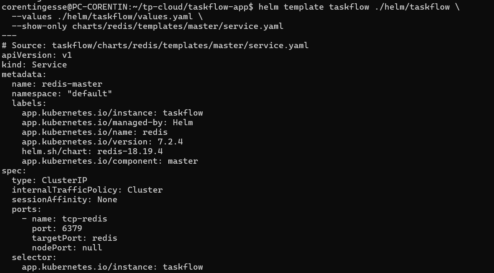
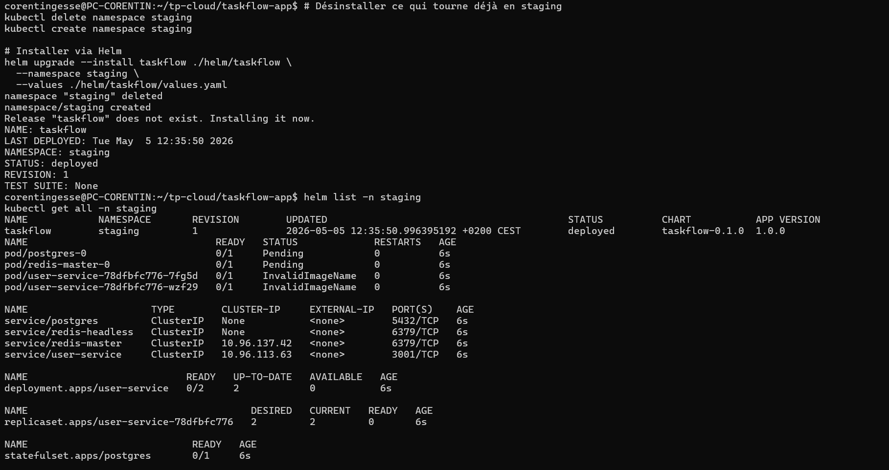
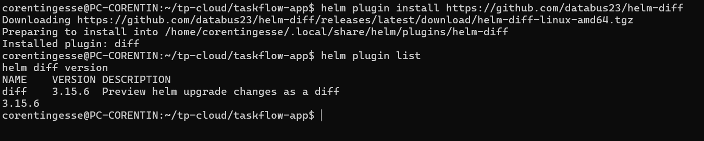
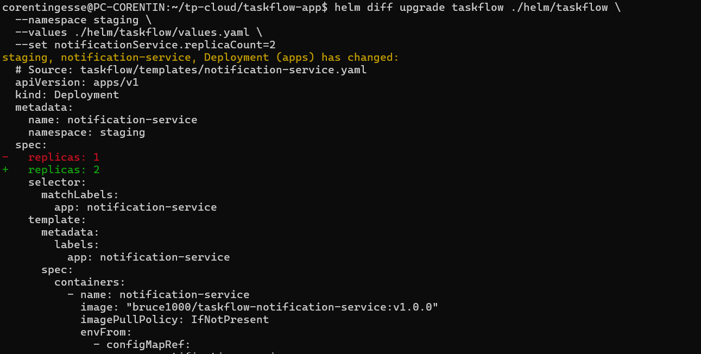
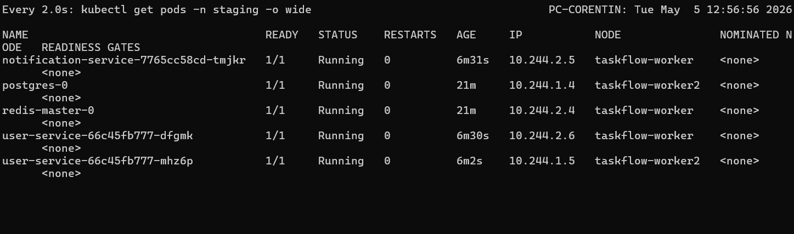
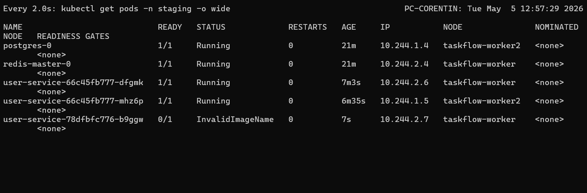
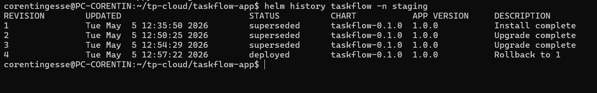

# TaskFlow — Partie 4A : Chart Helm de l'application

**Auteurs :** Naël BENHIBA et Corentin GESSE--ENTRESSANGLE

## Partie A - Application TaskFlow

## Étape 1 — Créer le chart de Taskflow

### Fichiers concernés

- `helm/taskflow/Chart.yaml`
- `helm/taskflow/values.yaml`
- `helm/taskflow/templates/user-service.yaml`
- `helm/taskflow/templates/postgres.yaml`

### Dépendance Redis ajoutée

Dans `helm/taskflow/Chart.yaml`, Redis est déclaré comme dépendance Helm :

```yaml
dependencies:
  - name: redis
    version: "18.x.x"
    repository: "https://charts.bitnami.com/bitnami"
    condition: redis.enabled
```

Cette configuration permet de déléguer le déploiement de Redis au chart Bitnami au lieu de maintenir un template Kubernetes maison.

### Configuration Redis dans `values.yaml`

```yaml
redis:
  enabled: true
  fullnameOverride: redis
  architecture: standalone
  auth:
    enabled: false
```

Le chart est configuré en mode standalone, sans authentification, pour rester aligné avec l'environnement de TP et avec les services TaskFlow existants.

---

## Vérification du nom du Service Redis

### Commande exécutée

```bash
helm template taskflow ./helm/taskflow \
  --values ./helm/taskflow/values.yaml \
  --show-only charts/redis/templates/master/service.yaml
```

### Observation



La sortie Helm montre que le Service Redis généré s'appelle bien :

```yaml
metadata:
  name: redis-master
```

Le Service exposé est de type `ClusterIP` et écoute sur le port `6379` :

```yaml
spec:
  type: ClusterIP
  ports:
    - name: tcp-redis
      port: 6379
      targetPort: redis
```

### Mise à jour de `REDIS_URL`

Même avec `fullnameOverride: redis`, le chart Bitnami Redis 18.x conserve le suffixe `-master` pour le Service du master. Les variables d'environnement Kubernetes des services qui utilisent Redis ont donc été mises à jour pour pointer vers :

```yaml
REDIS_URL: redis://redis-master:6379
```

Fichiers modifiés :

- `k8s/base/task-service/configmap.yaml`
- `k8s/base/notification-service/configmap.yaml`

Avant, les ConfigMaps pointaient vers :

```yaml
REDIS_URL: redis://redis:6379
```

Après correction :

```yaml
REDIS_URL: redis://redis-master:6379
```

Cette modification est nécessaire pour le déploiement Helm/Kubernetes, car le Service Redis généré par le chart Bitnami s'appelle `redis-master`. En Docker Compose, le service s'appelle encore `redis`, donc les fallbacks applicatifs restent compatibles avec `redis://redis:6379` lorsqu'aucune variable `REDIS_URL` n'est fournie.

---

## Réponses aux questions

### Question 1 — En vous appuyant sur le critère vu en cours, justifiez pourquoi Redis se prête à un chart officiel.

Redis se prête bien à un chart officiel car c'est un composant d'infrastructure standard, largement utilisé et peu spécifique à TaskFlow.

Son déploiement Kubernetes demande plusieurs choix techniques récurrents :

- Service stable pour exposer Redis dans le cluster
- Configuration standalone ou cluster
- Gestion optionnelle de l'authentification
- Probes de santé
- Ressources CPU/mémoire
- Persistance optionnelle
- Compatibilité avec différentes versions de Redis

Ces éléments ne dépendent pas directement du métier de l'application. Il est donc plus pertinent d'utiliser un chart maintenu par la communauté, comme `bitnami/redis`, plutôt que de réécrire et maintenir un template maison. Cela réduit le risque d'erreur et permet de bénéficier des bonnes pratiques déjà intégrées dans le chart.

### Question 2 — Pourquoi a-t-on conservé un template maison pour PostgreSQL plutôt que d'utiliser `bitnami/postgresql` ? Identifiez les deux éléments de votre configuration Postgres actuelle qui rendraient la migration vers Bitnami coûteuse.

Nous avons conservé un template maison pour PostgreSQL car notre configuration actuelle est fortement liée au fonctionnement de TaskFlow et à l'initialisation de sa base.

Deux éléments rendent la migration vers `bitnami/postgresql` plus coûteuse :

1. **Le script d'initialisation SQL intégré**

Le template actuel crée un `ConfigMap` `postgres-initdb` contenant directement le script `init.sql` avec les tables `users`, `tasks` et `notifications`, puis le monte dans `/docker-entrypoint-initdb.d`.

Migrer vers Bitnami demanderait d'adapter cette logique au mécanisme d'initialisation du chart Bitnami, qui n'utilise pas forcément les mêmes noms de valeurs, de volumes ou de conventions.

2. **La structure actuelle des secrets et de la chaîne de connexion**

Le template maison crée un `Secret` `postgres-secret` avec les clés `POSTGRES_USER`, `POSTGRES_PASSWORD` et `POSTGRES_DB`. Les services TaskFlow construisent ensuite leur `DATABASE_URL` avec ces valeurs et le nom de service interne `postgres`.

Avec Bitnami, les noms de secrets, les clés, le nom du service et certains paramètres de configuration peuvent différer. Il faudrait donc modifier les templates des services applicatifs, les valeurs Helm et potentiellement les références de connexion.

## Étape 2 — Values par environnement

### Problème observé

Le fichier `helm/taskflow/values.production.yaml` contenait une valeur sensible de production :

```yaml
postgres:
  password: REMPLACER_PAR_MOT_DE_PASSE_FORT
```

Même si cette valeur était un placeholder, le fichier de production ne doit pas porter de secret. En pratique, cela encourage à remplacer le placeholder par un vrai mot de passe dans un fichier versionné.

### Correction effectuée

La clé sensible `postgres.password` a été retirée de `helm/taskflow/values.production.yaml`.

Un fichier d'exemple non sensible a été ajouté :

```text
helm/taskflow/values.production-secrets.yaml.example
```

Le vrai fichier local de secrets est ignoré par Git :

```gitignore
helm/taskflow/values.production-secrets.yaml
helm/taskflow/values.*.local.yaml
```

### Déploiement avec un fichier de secrets local

En local, on peut créer un fichier non versionné :

```yaml
postgres:
  password: "mot-de-passe-fort"
```

Puis déployer avec plusieurs fichiers de values. Helm applique les fichiers dans l'ordre, donc le fichier de secrets surcharge les valeurs précédentes :

```bash
helm upgrade --install taskflow ./helm/taskflow \
  --namespace staging \
  --values ./helm/taskflow/values.yaml \
  --values ./helm/taskflow/values.production.yaml \
  --values ./helm/taskflow/values.production-secrets.yaml
```

### Déploiement avec une variable d'environnement

On peut aussi éviter le fichier local et passer le secret au moment du déploiement :

```bash
helm upgrade --install taskflow ./helm/taskflow \
  --namespace staging \
  --values ./helm/taskflow/values.yaml \
  --values ./helm/taskflow/values.production.yaml \
  --set-string postgres.password="$POSTGRES_PASSWORD"
```

---

## Réponses aux questions de l'étape 2

### Question 1 — Comment déployer avec des valeurs sensibles sans les commiter ? Sortez les valeurs sensibles des fichiers commités.

Les valeurs sensibles doivent être retirées des fichiers versionnés et injectées au moment du déploiement.

Dans ce projet, la valeur `postgres.password` a été retirée de `values.production.yaml`. Elle peut maintenant être fournie de deux façons :

- avec un fichier local `values.production-secrets.yaml`, ignoré par Git ;
- avec une variable d'environnement passée à Helm via `--set-string postgres.password="$POSTGRES_PASSWORD"`.

La première solution est pratique en local. La deuxième est plus adaptée à une CI/CD, car le secret peut venir du gestionnaire de secrets de la plateforme.

### Question 2 — Pourquoi cette solution est-elle plus sûre que de mettre les valeurs dans `values.production.yaml`, même dans un dépôt privé ?

Un dépôt privé ne garantit pas qu'un secret reste confidentiel. Plusieurs risques restent possibles :

- accès donné à trop de personnes ;
- fuite via un fork, une archive ou un poste développeur ;
- secret conservé dans l'historique Git même après suppression ;
- exposition accidentelle dans une pull request ou un outil d'analyse.

En sortant les secrets du dépôt, on évite qu'ils deviennent une donnée permanente de l'historique Git. Le dépôt contient uniquement la configuration déployable et les exemples, tandis que les vraies valeurs sensibles restent dans l'environnement local, la CI/CD ou un gestionnaire de secrets.

### Question 3 — Quel problème `helm-secrets` résout-il que cette solution ne résout pas ? Dans quel contexte devient-il nécessaire ?

La solution actuelle évite de commiter les secrets, mais elle ne permet pas de versionner les vraies valeurs sensibles. Chaque environnement doit fournir ses secrets séparément.

`helm-secrets` résout ce problème en permettant de stocker dans Git des fichiers de values chiffrés. Les secrets restent versionnés, relus et auditables, mais ils ne sont pas visibles en clair. Le déchiffrement se fait uniquement au moment du `helm upgrade`, avec une clé GPG, AWS KMS ou un autre backend compatible.

Cet outil devient nécessaire quand :

- plusieurs environnements doivent avoir leurs propres secrets versionnés ;
- plusieurs membres ou pipelines doivent déployer de façon reproductible ;
- l'équipe veut auditer les changements de secrets sans exposer leur contenu ;
- l'organisation impose que la configuration complète soit gérée en GitOps.

### Question 4 — Dans GitHub Actions, comment passer `$POSTGRES_PASSWORD` dans `helm upgrade` sans qu'il apparaisse en clair dans les logs ?

Dans GitHub Actions, il faut stocker le mot de passe dans `Settings > Secrets and variables > Actions`, par exemple sous le nom `POSTGRES_PASSWORD`.

Ensuite, on le passe à Helm via une variable d'environnement :

```yaml
- name: Deploy with Helm
  env:
    POSTGRES_PASSWORD: ${{ secrets.POSTGRES_PASSWORD }}
  run: |
    helm upgrade --install taskflow ./helm/taskflow \
      --namespace staging \
      --values ./helm/taskflow/values.yaml \
      --values ./helm/taskflow/values.production.yaml \
      --set-string postgres.password="$POSTGRES_PASSWORD"
```

GitHub Actions masque automatiquement les valeurs issues de `secrets.*` dans les logs. Il faut aussi éviter d'afficher la commande avec `set -x`, de faire un `echo` du secret, ou de générer un manifeste contenant le secret en clair dans les logs.

---

## Étape 3 — Installation du chart

### Génération du rendu Helm

Avant d'installer le chart dans le cluster, le rendu complet a été généré avec :

```bash
helm template taskflow ./helm/taskflow \
  --values ./helm/taskflow/values.yaml
```

La commande génère bien les ressources actuellement présentes dans le chart :

- les ressources du sous-chart Redis Bitnami ;
- le `Secret`, le `ConfigMap`, le `Service` et le `StatefulSet` PostgreSQL ;
- le `Service` et le `Deployment` du `user-service`.

Observation importante : le chart ne contient pas encore de template Helm pour `task-service`.

```bash
helm template taskflow ./helm/taskflow \
  --values ./helm/taskflow/values.yaml \
  --show-only templates/task-service.yaml
```

Résultat :

```text
Error: could not find template templates/task-service.yaml in chart
```

À ce stade, la vérification demandée sur le `task-service` ne peut donc pas être faite strictement tant que `helm/taskflow/templates/task-service.yaml` n'a pas été créé.

### Installation et vérification dans `staging`

Le chart a ensuite été installé dans le namespace `staging` :

```bash
kubectl delete namespace staging
kubectl create namespace staging

helm upgrade --install taskflow ./helm/taskflow \
  --namespace staging \
  --values ./helm/taskflow/values.yaml
```

La release Helm est bien créée :

```text
Release "taskflow" does not exist. Installing it now.
STATUS: deployed
REVISION: 1
```

La vérification avec `helm list -n staging` confirme que la release `taskflow` est déployée :

```text
NAME       NAMESPACE   REVISION   STATUS     CHART            APP VERSION
taskflow   staging     1          deployed   taskflow-0.1.0   1.0.0
```



La commande `kubectl get all -n staging` montre les ressources créées par le chart :

- `pod/postgres-0`
- `pod/redis-master-0`
- deux pods `user-service`
- `service/postgres`
- `service/redis-headless`
- `service/redis-master`
- `service/user-service`
- `deployment.apps/user-service`
- `statefulset.apps/postgres`

Observation : les pods `user-service` apparaissent en `InvalidImageName`. Cela confirme le problème identifié dans la question 1 : le template construit l'image avec `{{ .Values.image.tag }}`, mais cette valeur n'est pas définie dans `values.yaml`. Le rendu produit donc une image incomplète du type `bruce1000/taskflow-user-service:`.

---

## Réponses aux questions de l'étape 3

### Question 1 — Que se passe-t-il si une variable référencée dans un template n'a pas de valeur correspondante dans `values.yaml` ?

Par défaut, Helm ne bloque pas forcément le rendu lorsqu'une valeur est absente. Si un template référence une clé inexistante, Helm peut rendre une valeur vide ou `<no value>` selon le contexte.

Dans le chart actuel, le template `user-service.yaml` référence :

```yaml
image: "{{ .Values.image.prefix }}-user-service:{{ .Values.image.tag }}"
```

Or `values.yaml` contient bien `image.prefix`, mais ne contient pas `image.tag`. Le rendu Helm produit donc :

```yaml
image: "bruce1000/taskflow-user-service:"
```

La commande `helm template` ne plante pas, mais le manifeste généré est problématique : l'image n'a pas de tag valide. Kubernetes risque ensuite de refuser le déploiement ou de ne pas pouvoir tirer l'image correctement.

Conclusion : une valeur manquante n'est pas toujours détectée automatiquement par Helm. Pour sécuriser le chart, il faudrait utiliser `required`, `default`, ou définir toutes les valeurs attendues dans `values.yaml`.

Exemple plus sûr :

```yaml
image: "{{ .Values.image.prefix }}-user-service:{{ required "image.tag is required" .Values.image.tag }}"
```

ou ajouter une valeur par défaut :

```yaml
image:
  prefix: bruce1000/taskflow
  tag: v1.0.0
```

### Question 2 — Comparez la sortie de `helm template` sur le `task-service` avec le fichier `k8s/base/task-service/deployment.yaml`. Quelles différences structurelles observez-vous ? Pourquoi existent-elles ?

Dans l'état actuel du chart, la comparaison directe n'est pas possible car le template Helm du `task-service` n'existe pas encore.

Le fichier Kubernetes existe bien :

```text
k8s/base/task-service/deployment.yaml
```

Mais le fichier Helm attendu est absent :

```text
helm/taskflow/templates/task-service.yaml
```

La commande de rendu ciblée retourne donc :

```text
Error: could not find template templates/task-service.yaml in chart
```

En revanche, en comparant le style du template Helm existant `user-service.yaml` avec le manifeste Kubernetes statique du `task-service`, on observe les différences structurelles attendues entre Helm et Kubernetes brut :

- **Namespace dynamique :** Helm utilise `{{ .Release.Namespace }}`, alors que le manifeste statique contient `namespace: staging`.
- **Replicas paramétrables :** Helm lit `replicas` depuis `values.yaml`, alors que le manifeste statique fixe directement `replicas: 2`.
- **Images paramétrables :** Helm construit l'image depuis les valeurs du chart, alors que le manifeste statique écrit directement `taskflow-task-service:v1.0.0`.
- **Configuration centralisée :** Helm permet de piloter les ports, tags, ressources et variables depuis `values.yaml`, au lieu de dupliquer ces valeurs dans chaque fichier YAML.
- **Rendu final généré :** le YAML Helm final contient des valeurs résolues au moment du `helm template` ou `helm upgrade`, alors que le YAML Kubernetes statique est directement appliqué tel quel.

Ces différences existent parce que Helm ajoute une couche de templating au-dessus de Kubernetes. L'objectif est d'éviter la duplication, de faciliter les changements entre environnements, et de rendre le déploiement plus maintenable quand le nombre de services augmente.

### Conclusion de l'étape 3

Le rendu Helm actuel est partiel : il couvre Redis, PostgreSQL et `user-service`, mais pas encore `task-service`. L'étape d'installation peut donc valider la mécanique du chart, mais le chart doit encore être complété avec les templates manquants avant de remplacer entièrement les manifests Kubernetes de `k8s/base/`.

---

## Étape 4 — Prévisualiser un `helm upgrade`

### Plugin trouvé

Le plugin Helm qui permet de visualiser l'impact d'un `helm upgrade` avant de l'appliquer est :

```text
helm-diff
```

Repository officiel :

```text
https://github.com/databus23/helm-diff
```

Le README du plugin indique qu'il fournit une prévisualisation de ce qu'un `helm upgrade` va changer, en comparant la dernière release déployée avec le rendu du chart local.

### Installation du plugin

```bash
helm plugin install https://github.com/databus23/helm-diff
```

Vérification :

```bash
helm plugin list
helm diff version
```



La capture montre que le plugin `diff` est installé en version `3.15.6` et qu'il est bien reconnu par Helm avec la description `Preview helm upgrade changes as a diff`.

### Commande de prévisualisation

Avant d'appliquer un upgrade réel, on peut lancer :

```bash
helm diff upgrade taskflow ./helm/taskflow \
  --namespace staging \
  --values ./helm/taskflow/values.yaml
```

Cette commande affiche les ressources Kubernetes qui seraient ajoutées, modifiées ou supprimées si on lançait ensuite :

```bash
helm upgrade taskflow ./helm/taskflow \
  --namespace staging \
  --values ./helm/taskflow/values.yaml
```

### Intérêt pour TaskFlow

Dans le contexte du TP, `helm-diff` est utile pour vérifier l'impact d'une modification avant de l'appliquer au cluster. Par exemple, si on ajoute une instance au `notification-service`, le diff doit montrer une modification du champ :

```yaml
spec:
  replicas: 2
```

au lieu de :

```yaml
spec:
  replicas: 1
```

Cela permet de confirmer que le changement attendu est bien celui qui sera envoyé à Kubernetes, sans découvrir l'impact seulement après le `helm upgrade`.

### Exemple de diff observé

Pour tester le plugin, l'ajout d'une instance au `notification-service` a été prévisualisé sans modifier le fichier `values.yaml`, grâce à `--set` :

```bash
helm diff upgrade taskflow ./helm/taskflow \
  --namespace staging \
  --values ./helm/taskflow/values.yaml \
  --set notificationService.replicaCount=2
```



La sortie montre que le `Deployment` `notification-service` serait modifié dans le namespace `staging` :

```diff
- replicas: 1
+ replicas: 2
```

Cela confirme que `helm-diff` permet de vérifier précisément l'impact d'un futur `helm upgrade` avant de l'appliquer réellement au cluster.

### Question — Dans quel scénario cet outil est-il particulièrement critique : un changement de `replicaCount` ou un changement de `image.<service>.tag` ?

`helm-diff` est particulièrement critique pour un changement de `image.<service>.tag`.

Un changement de `replicaCount` modifie surtout le nombre de pods attendus. Kubernetes ajoute ou supprime des replicas, mais les pods existants gardent la même image et la même configuration applicative. L'impact est généralement limité à la capacité de traitement ou à la consommation de ressources. Si on passe par exemple de 1 à 2 replicas, Kubernetes crée une instance supplémentaire du même service.

Un changement de `image.<service>.tag` déclenche en revanche un rolling update du `Deployment`. Kubernetes crée de nouveaux pods avec la nouvelle image, attend qu'ils deviennent prêts, puis remplace progressivement les anciens pods. Ce changement est plus risqué car il peut introduire :

- une version applicative cassée ;
- une image inexistante ou inaccessible ;
- une erreur de configuration au démarrage ;
- une incompatibilité avec les variables d'environnement, la base de données ou les autres services ;
- une indisponibilité si les probes échouent ou si le rollout reste bloqué.

Dans ce cas, `helm-diff` permet de vérifier avant application que seul le tag attendu change, et qu'aucune autre ressource critique n'est modifiée par erreur. C'est important en production, car un mauvais tag peut déclencher un rolling update complet et remplacer des pods fonctionnels par des pods qui ne démarrent pas.

Conclusion : `helm-diff` reste utile pour un changement de `replicaCount`, mais il devient beaucoup plus critique pour un changement de `image.<service>.tag`, car ce dernier modifie réellement la version du code exécuté et déclenche un rolling update Kubernetes.

---

## Application, observation et rollback

### Application du changement

Après la prévisualisation avec `helm-diff`, le changement a été appliqué avec :

```bash
helm upgrade taskflow ./helm/taskflow \
  --namespace staging \
  --values ./helm/taskflow/values.yaml
```

Pendant l'opération, un terminal de supervision était ouvert avec :

```bash
watch kubectl get pods -n staging -o wide
```

### Observation du rolling update



La capture sert de preuve d'observation du namespace `staging` pendant le suivi avec `watch`.

### Rollback Helm

Le rollback vers la première révision a été testé avec :

```bash
helm rollback taskflow 1 -n staging
```

Après rollback, la supervision des pods montre :



La capture sert de preuve d'observation du namespace `staging` après le rollback vers la révision 1.

### Historique Helm

L'historique a été consulté avec :

```bash
helm history taskflow -n staging
```



La capture sert de preuve de l'historique Helm après le rollback.

---

## Réponses aux questions — Historique des déploiements

### Question 1 — Décrivez ce que vous avez vu avec `watch kubectl get pods -n staging -o wide`.

Avec `watch kubectl get pods -n staging -o wide`, on observe l'évolution des pods en direct pendant l'upgrade et le rollback.

Pendant l'upgrade, les pods applicatifs restent visibles dans le namespace `staging`. Les pods déjà prêts restent en `Running` pendant que Kubernetes applique le nouvel état demandé par Helm. Dans la capture avant rollback, on voit notamment :

- `notification-service` en `1/1 Running` ;
- `postgres-0` en `1/1 Running` ;
- `redis-master-0` en `1/1 Running` ;
- deux pods `user-service` en `1/1 Running`.

Après le rollback, Kubernetes tente de restaurer l'état de la révision 1. On voit alors apparaître un pod `user-service` en `InvalidImageName`, ce qui montre que Helm a bien restauré l'ancienne configuration, y compris son problème d'image sans tag complet.

Cette observation illustre le fonctionnement d'un rolling update : Kubernetes fait évoluer progressivement les pods gérés par les Deployments, tout en essayant de maintenir l'application disponible lorsque les probes et les images sont correctes.

### Question 2 — Quelle information présente dans `helm history` est absente de `kubectl rollout history` et pourquoi est-elle critique en production ?

`helm history` donne l'historique global d'une release Helm. Il affiche notamment :

- le numéro de révision Helm ;
- la date de mise à jour ;
- le statut de chaque révision (`deployed`, `superseded`, etc.) ;
- le chart utilisé ;
- l'app version ;
- la description de l'action (`Install complete`, `Upgrade complete`, `Rollback to 1`).

Dans notre capture, `helm history taskflow -n staging` montre par exemple que la révision 4 est actuellement `deployed` avec la description `Rollback to 1`.

`kubectl rollout history`, lui, est limité à l'historique d'un seul objet Kubernetes, généralement un `Deployment`. Il ne donne pas une vision globale de toute l'application packagée par Helm.

Cette différence est critique en production car une application ne se limite pas à un seul Deployment. Une release Helm peut contenir plusieurs Deployments, Services, ConfigMaps, Secrets, StatefulSets et dépendances. En cas d'incident, `helm history` permet de savoir quelle version complète de l'application a été installée, mise à jour ou restaurée.

### Question 3 — `helm rollback taskflow 1` et `kubectl rollout undo deployment/task-service` semblent faire la même chose. Quelle est la différence fondamentale quand votre application déploie plusieurs ressources en même temps ?

`kubectl rollout undo deployment/task-service` annule uniquement le rollout d'un seul Deployment : ici, `task-service`. Il ne restaure pas les autres ressources associées à l'application.

`helm rollback taskflow 1`, en revanche, restaure toute la release Helm à la révision 1. Cela peut inclure :

- plusieurs Deployments ;
- des Services ;
- des ConfigMaps ;
- des Secrets ;
- des StatefulSets ;
- des dépendances comme Redis.

La différence fondamentale est donc le périmètre du rollback. `kubectl rollout undo` agit sur une ressource Kubernetes isolée, alors que `helm rollback` agit sur l'application complète telle qu'elle a été déployée par le chart.

C'est important lorsque plusieurs ressources doivent rester cohérentes entre elles. Par exemple, si une nouvelle image applicative dépend d'une nouvelle variable dans un ConfigMap, revenir uniquement au Deployment sans restaurer le ConfigMap peut laisser l'application dans un état incohérent. Helm évite ce problème en restaurant l'ensemble de la release.
