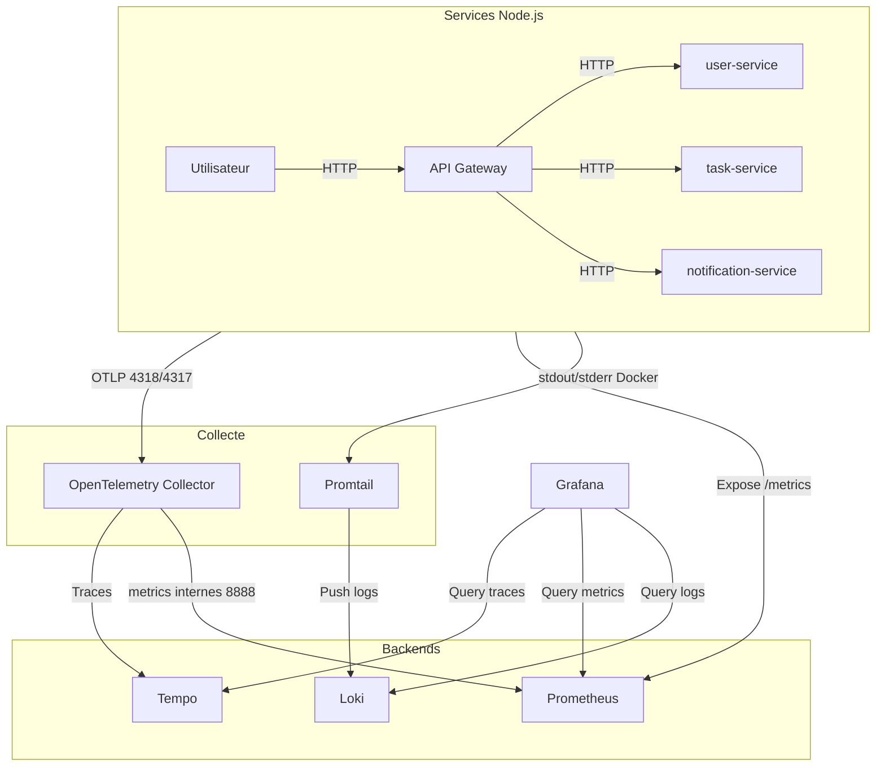

# Stack Observability (Grafana / Tempo / OpenTelemetry / Loki / Prometheus)

Ce document explique **qui fait quoi** dans la stack d’observabilité de ce repo, et **comment les données circulent** (traces, logs, métriques).

## Vue d’ensemble (les 3 types de signaux)

- **Traces**: “le film” d’une requête (API Gateway → services → DB), découpée en *spans*.
- **Metrics**: des chiffres agrégés (ex: nombre de requêtes, latence P95, erreurs).
- **Logs**: des événements textuels structurés (ex: erreurs applicatives), consultables et filtrables.

## Schéma (stack & flux)

## Qui fait quoi

### Grafana

- **Rôle**: UI unique pour explorer et corréler **traces (Tempo)**, **logs (Loki)**, **métriques (Prometheus)**.
- **Accès**:
  - Host: `http://localhost:3300`
- **Config dans le repo**:
  - Datasources provisionnées dans `infra/grafana/provisioning/datasources/datasources.yml`

### Tempo

- **Rôle**: backend de **traces** (stocke et indexe les traces, permet la recherche).
- **Entrées**:
  - Reçoit des traces en **OTLP** (gRPC/HTTP) depuis l’OpenTelemetry Collector.
- **Sorties**:
  - Sert les requêtes de Grafana (explore, recherche de traces).
- **Accès**:
  - Host: `http://localhost:3200`
- **Config dans le repo**:
  - `infra/tempo/tempo.yml`

### OpenTelemetry Collector (otel-collector)

- **Rôle**: “hub” de télémétrie. Il **reçoit** des traces/métriques en OTLP, les **batch**, puis les **exporte** vers les backends.
- **Entrées**:
  - OTLP gRPC: `otel-collector:4317` (host: `localhost:4317`)
  - OTLP HTTP: `otel-collector:4318` (host: `localhost:4318`)
  - Les services Node envoient vers lui via `OTEL_EXPORTER_OTLP_ENDPOINT` (dans `.env`).
- **Sorties**:
  - **Traces → Tempo**
  - **Métriques → exporter Prometheus (pull)**
  - Export debug (console) pour diagnostiquer
- **Accès / ports utiles**:
  - `4317` / `4318`: réception OTLP
  - `8888`: métriques internes du collector (scrapées par Prometheus)
- **Config dans le repo**:
  - `infra/otel/config.yml`

### Prometheus

- **Rôle**: backend de **métriques**. Il *scrape* (pull) des endpoints `/metrics` et stocke les séries temporelles.
- **Entrées**:
  - Scrape les services applicatifs (ex: `api-gateway:3000/metrics`, etc.)
  - Scrape le collector (métriques internes) sur `otel-collector:8888`
- **Sorties**:
  - Grafana interroge Prometheus pour dashboards et Explore Metrics.
- **Accès**:
  - Host: `http://localhost:9090`
- **Config dans le repo**:
  - Targets configurés dans `infra/prometheus/prometheus.yml`

### Loki

- **Rôle**: backend de **logs** (indexation légère + stockage).
- **Entrées**:
  - Reçoit les logs envoyés par **Promtail**.
- **Sorties**:
  - Grafana interroge Loki (Explore Logs, dashboards).
- **Accès**:
  - Host: `http://localhost:3100`
- **Config dans le repo**:
  - `infra/loki/loki-config.yml`

### Promtail

- **Rôle**: agent de collecte de logs. Il **lit les logs Docker** des conteneurs et les **pousse** vers Loki.
- **Entrées**:
  - `/var/lib/docker/containers` (logs des conteneurs)
  - Docker socket (pour enrichissement/labels selon config)
- **Sorties**:
  - Push vers Loki
- **Config dans le repo**:
  - `infra/promtail/promtail-config.yml`

## Flux de données (du service jusqu’à Grafana)

### Traces (Tempo)

1. Un utilisateur appelle l’app (ex: `POST /api/users/register`).
2. Les services Node (api-gateway, user-service, etc.) génèrent des *spans* via OpenTelemetry (`src/tracing.js`).
3. Les services envoient les spans vers **otel-collector** via `OTEL_EXPORTER_OTLP_ENDPOINT` (OTLP HTTP par défaut dans notre code).
4. **otel-collector** exporte ces traces vers **Tempo** (OTLP gRPC en interne).
5. **Grafana** (datasource Tempo) permet de chercher/explorer les traces.

### Metrics (Prometheus)

1. Les services exposent un endpoint HTTP **`/metrics`** (Prometheus format).
2. **Prometheus** scrape ces endpoints à intervalle régulier.
3. **Grafana** (datasource Prometheus) affiche dashboards/Explore.

### Logs (Loki)

1. Les services écrivent leurs logs sur stdout/stderr (dans Docker).
2. **Promtail** lit ces logs, ajoute des labels, et les envoie à **Loki**.
3. **Grafana** (datasource Loki) permet de rechercher/filtrer.

## Où regarder quand “je ne vois rien”

- **Traces vides dans Tempo**:
  - Vérifier que `otel-collector` tourne et n’a pas d’erreur de config.
  - Vérifier que les services ont bien `OTEL_EXPORTER_OTLP_ENDPOINT=http://otel-collector:4318` dans `.env`.
  - Générer du trafic (register/login) et vérifier que `resource.service.name` remonte.

- **Métriques absentes**:
  - Vérifier que `/metrics` répond sur les services.
  - Vérifier les `scrape_configs` dans `infra/prometheus/prometheus.yml`.

- **Logs absents dans Loki**:
  - Vérifier que `promtail` tourne et a accès aux volumes Docker.
  - Vérifier la config `infra/promtail/promtail-config.yml` et `infra/loki/loki-config.yml`.

## Ports (récap)

- **Grafana**: `3300` (host) → `3000` (container)
- **Prometheus**: `9090`
- **Loki**: `3100`
- **Tempo**: `3200` (API Tempo + requêtes Grafana)
- **OTel Collector**: `4317` (OTLP gRPC), `4318` (OTLP HTTP), `8888` (metrics internes)

